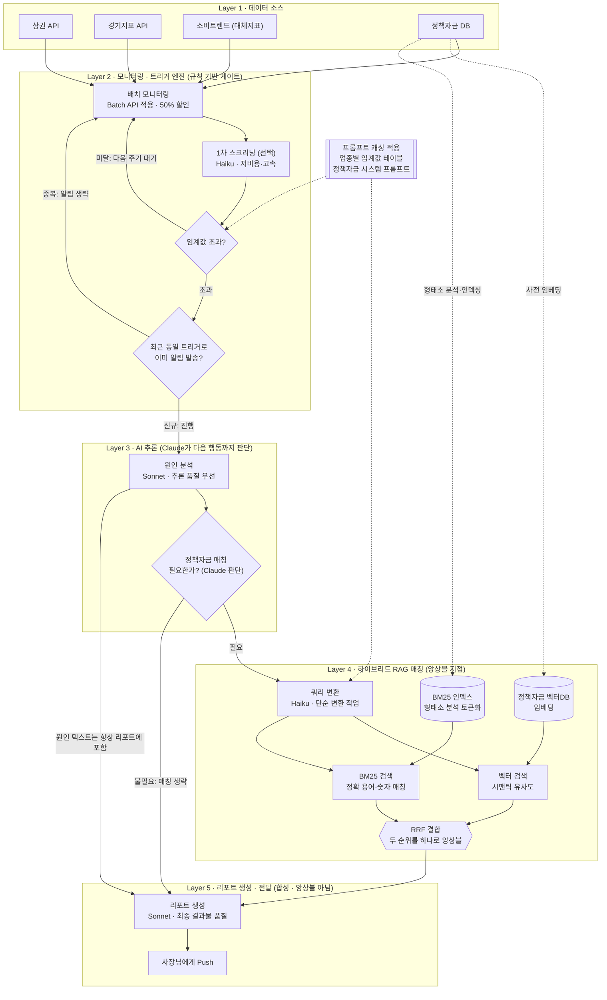
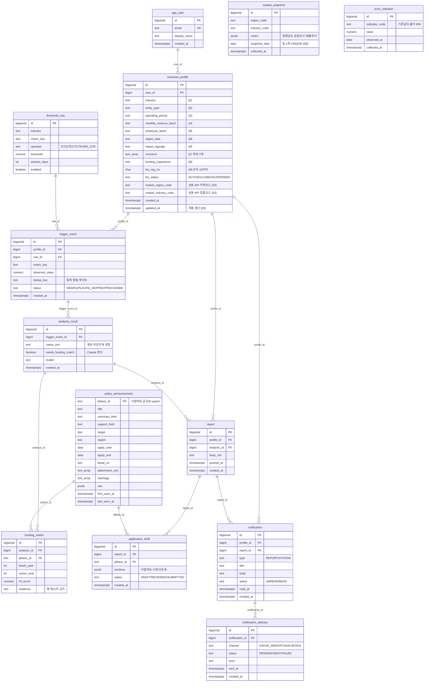

# 소상공인 금융 지원 에이전트 (v1.2 기반 MVP)

상시 모니터링 → 임계값 트리거 → Claude 원인 분석 → 하이브리드 RAG 정책자금 매칭 → 리포트 push → (확장) 신청서류 초안 생성

## 모노레포 구조

```
biz-agent/
├── apps/
│   ├── api-core/      # Spring Boot 3 (Java 21) — 백엔드 전담: 프로필/리포트 CRUD, L1 수집,
│   │                  #   L2 규칙 트리거·중복방지, 파이프라인 오케스트레이션, 일일 스케줄러, push
│   ├── ai-engine/     # FastAPI (Python) — AI 전담: Haiku 스크리닝/쿼리변환,
│   │                  #   Sonnet 원인분석/리포트/초안, 하이브리드 RAG(BM25+벡터+RRF), 인덱싱
│   └── web/           # Next.js (App Router) — 온보딩 질문지, 리포트 뷰어
├── db/init/           # PostgreSQL 초기 스키마 (pgvector 포함) — 스키마 단일 소스
├── docker-compose.yml # postgres(pgvector) + chroma + 3개 앱
└── .env.example
```

## 역할 경계 (Spring = 백엔드, Python = AI)

- **Spring(api-core)이 유일한 데이터 오너**: 수집·저장·조회·트리거 판정·스케줄링·push 전부 담당
- **Python(ai-engine)은 stateless AI 서비스**: Spring이 컨텍스트(프로필·트리거·공고)를 담아 호출하면 Claude 결과만 반환. 예외적으로 인덱싱(`/index/rebuild`)만 Postgres를 직접 읽어 BM25·Chroma를 구성

## 아키텍처 ↔ 다이어그램 레이어 매핑

| 레이어 | 담당 | 위치 |
| --- | --- | --- |
| L1 데이터 소스 수집 | Spring `@Scheduled` 배치 | `api-core/.../collect/` |
| L2 트리거 (규칙 게이트: 임계값·중복방지) | Spring 결정론 룰 | `api-core/.../trigger/TriggerEngine.java` |
| L2 1차 스크리닝(선택, Haiku) | Python | `ai-engine/app/services/screening.py` |
| L3 원인 분석 + 매칭 필요 판단 (Sonnet) | Python | `ai-engine/app/services/cause_analysis.py` |
| L4 하이브리드 RAG (쿼리변환→BM25∥벡터→RRF) | Python | `ai-engine/app/services/rag/` |
| L5 리포트 생성 (Sonnet, 합성·앙상블 아님) | Python 생성 → Spring 저장·push | `report_gen.py` → `PipelineService` |
| 오케스트레이션 (L3→L4→L5 지휘) | Spring | `api-core/.../pipeline/PipelineService.java` |
| 확장(5-3) 신청서류 초안 | Python 생성 → Spring 저장 | `draft_engine.py` → `AgentController` |

## DB 역할 분담

- **PostgreSQL (+pgvector)**: 프로필, 수집 원본, 트리거 이벤트, 분석 결과, 리포트, 알림 이력(중복 방지 키)
- **Chroma**: 정책자금 공고문 임베딩 (벡터 검색 축). BM25 인덱스는 ai-engine 프로세스 내(kiwi 형태소 + rank_bm25)

## 빠른 시작

```bash
cp .env.example .env   # ANTHROPIC_API_KEY 등 채우기
docker compose up -d postgres chroma
# 각 앱 로컬 실행
cd apps/ai-engine && pip install -r requirements.txt && uvicorn app.main:app --reload --port 8000
cd apps/api-core  && ./gradlew bootRun          # :8080
cd apps/web       && npm i && npm run dev       # :3000
```

## 요청 흐름

web(3000) → api-core(8080, 저장·인증) → ai-engine(8000, AI 파이프라인) → postgres/chroma
배치: Spring @Scheduled(매일 06:00) → 수집 → ai-engine /index/rebuild → 트리거 평가 → 파이프라인 → 리포트 저장·push
데모: POST /api/agent/check/{profileId} 로 즉시 실행 가능

## 아키텍처 구조도




## 전체 ERD

스키마 단일 소스는 `db/init/*.sql` (01 기본 스키마 → 02 임계값 시드 → 03 보완: 사용자·알림·인덱스·무결성). 아래는 전체 테이블 관계도.


