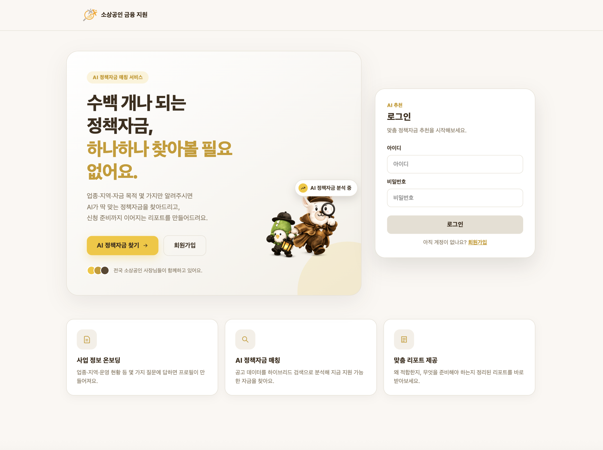
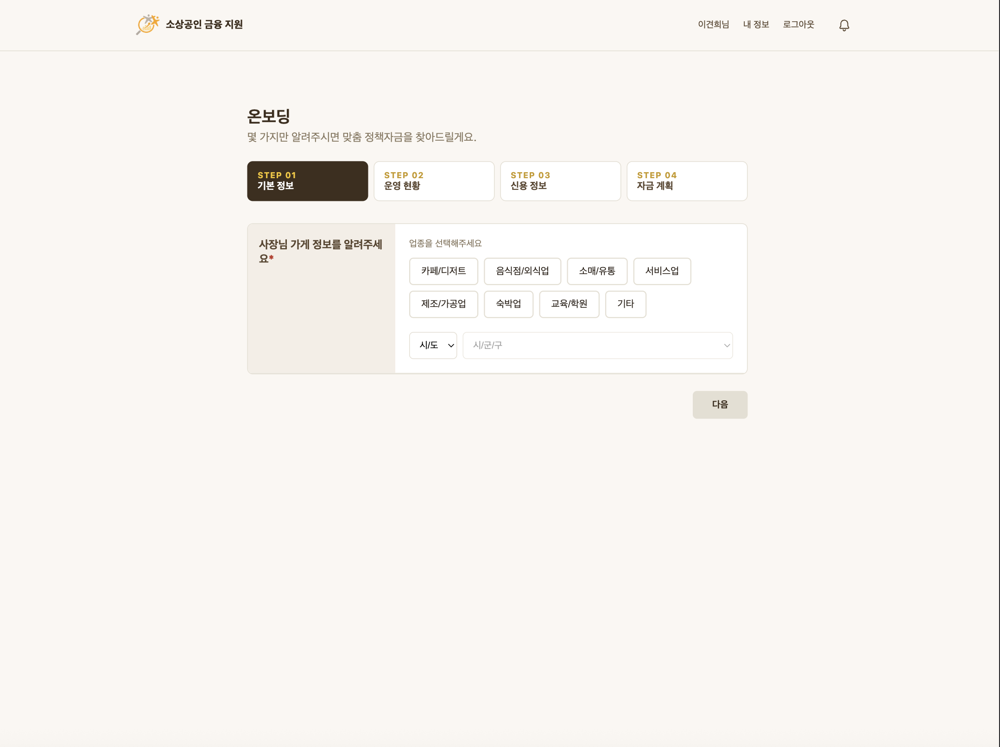
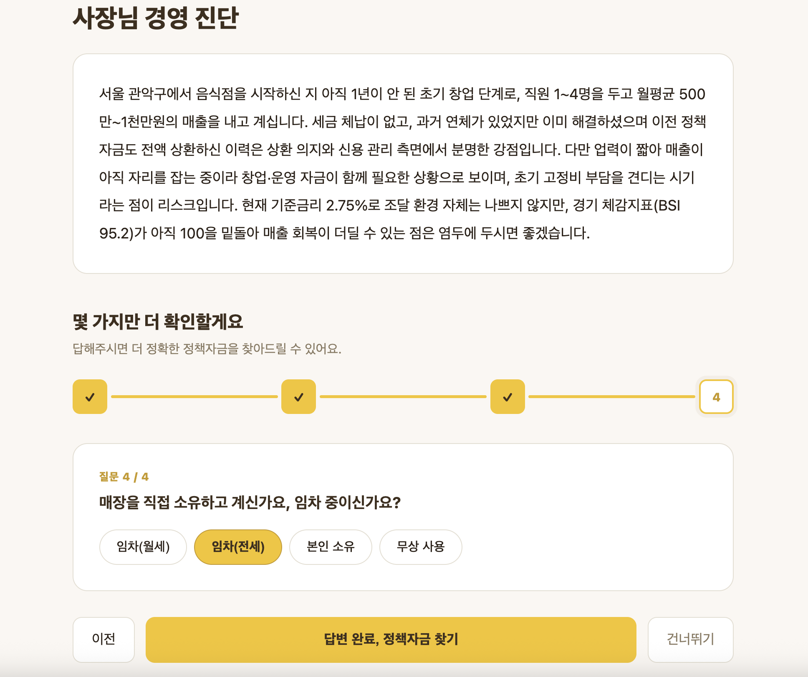
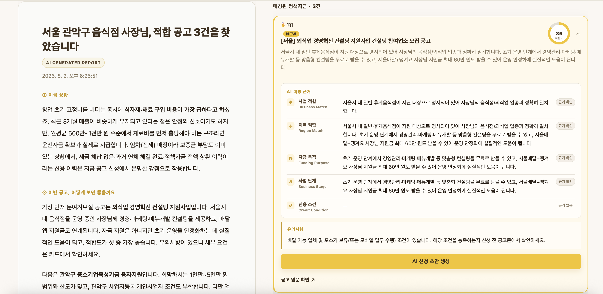
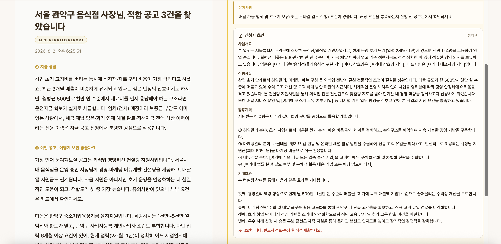
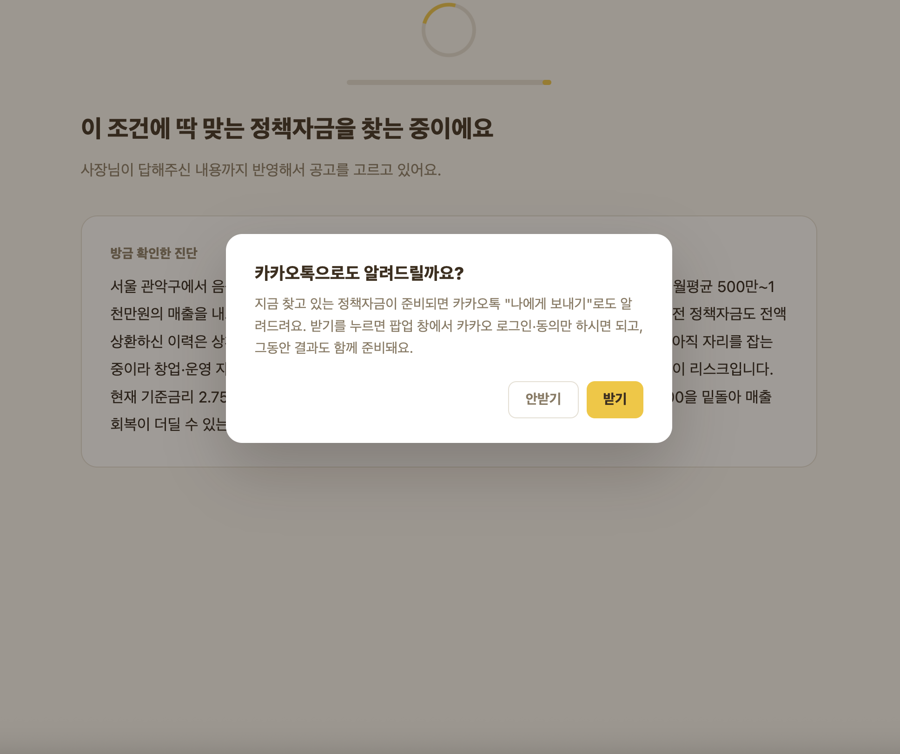
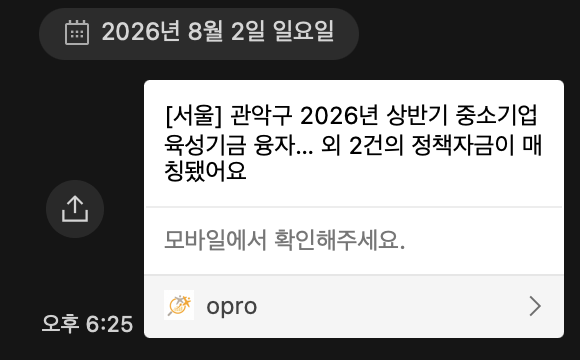
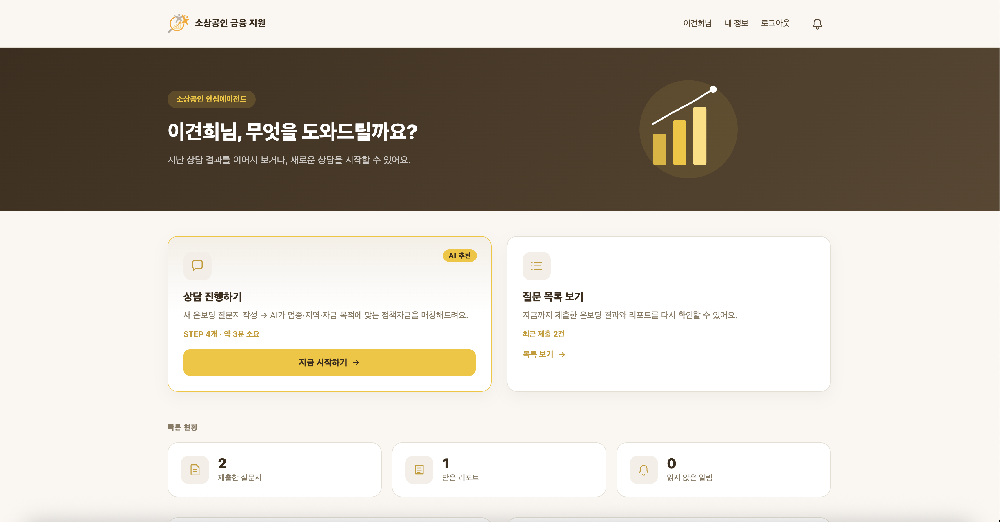
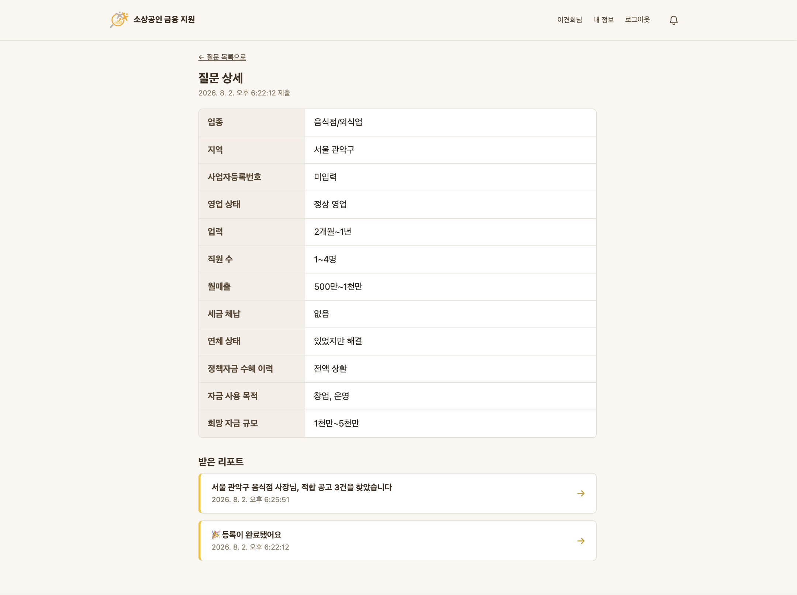
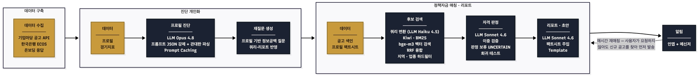

# Opro — 소상공인 안심에이전트

**KB AI Challenge · 팀 Just-it**

소상공인 대상으로 정책자금 지원 공고를 매칭하고, 진단·리포트·신청서 초안까지 자동 생성하는 프로액티브 AI 에이전트입니다.

소상공인이 정책자금을 놓치는 건 정보가 없어서가 아니라, 여러 채널에 흩어져 있고 조건이 바뀌었을 때 먼저 알려주는 주체가 없기 때문입니다. 최초 상담은 사용자의 요청으로 시작됩니다. 프로필이 등록된 이후에는 신규 정책공고를 주기적으로 재매칭하고, 새로운 지원 기회가 발견되면 인앱·카카오 알림으로 먼저 안내합니다 — 조회 시점의 스냅샷만 주는 KB의 기존 정적·사용자 주도형 서비스와의 핵심 차이입니다.

---

## 한눈에 보기

| 항목 | 내용 |
| --- | --- |
| 해결 문제 | 흩어진 공고와 복잡한 신청 조건 때문에 정책자금 지원 기회를 놓치는 문제 |
| 주요 사용자 | 정책자금 탐색·신청 준비에 시간을 쓰기 어려운 소상공인 |
| 핵심 흐름 | 온보딩 → 진단·추가 질문 → 매칭·자격 검증 → 리포트 → (선택) 신청서 초안 → 재매칭 알림 |
| AI 구조 | Claude 모델 등급 배분(Opus 진단 / Sonnet 판단·서술 / Haiku 쿼리 변환) + BM25·벡터 하이브리드 RAG |
| 데이터 | 기업마당 정책공고, 한국은행 ECOS 경기지표, 사용자 온보딩·상담 응답 |
| 서비스 구성 | Next.js · Spring Boot · FastAPI · PostgreSQL · ChromaDB (Docker Compose) |
| 핵심 차별점 | 신청 불가 공고 선제 배제(이중 검증) · 근거·유의사항 동반 추천 · 신규 공고 자동 재매칭 |

---

## 사용자 시나리오

```
회원가입
  → 사업 정보 온보딩
  → AI가 불확실한 조건을 추가 질문
  → 신청 가능한 정책자금만 추천
  → 추천 근거와 유의사항 확인
  → 맞춤 분석 리포트 생성
  → 신청서 초안 작성
  → 신규 공고 발생 시 인앱·카카오 알림
```

사용자는 사업 정보와 필요한 추가 질문에만 답합니다. 공고 검색·자격 검증·추천 근거 생성·주기적 재매칭은 에이전트가 수행합니다.

### 화면으로 보기

**0. 시작 화면** — 로그인/회원가입 후 온보딩으로 진입합니다.



**1. 온보딩** — 업종·지역 등 기본 정보만 입력합니다.



**2. AI가 불확실한 조건을 추가 질문** — 입력값만으로 판단이 애매한 부분(임차 여부 등)은 진단 후 직접 되묻습니다.



**3. 정책자금 추천과 근거 확인** — 추천에서 끝나지 않고, 건마다 사업 적합·지역 적합 등 근거와 유의사항을 함께 보여줍니다.



**4. 맞춤 리포트 → 신청서 초안** — 왜 적합한지 설명하는 리포트에서 바로 신청서 초안까지 한 화면에서 이어집니다.



**5. 신규 공고 알림** — 동의한 사용자에게는 카카오 "나에게 보내기"로도 알려드립니다(왼쪽: 인앱 동의, 오른쪽: 실제 수신 화면).

| 인앱 동의 | 카카오 수신 |
| --- | --- |
|  |  |

### 다시 찾아와도

온보딩은 한 번이지만 기록은 남습니다 — 로그인 후 이전 상담을 이어보거나, 지금까지 제출한 질문과 받은 리포트를 한 번에 확인할 수 있습니다.

| 홈 (이어서 보기 / 새로 시작) | 질문 상세 (제출 이력 + 받은 리포트) |
| --- | --- |
|  |  |

---

## AI 신뢰성 원칙

금융 관련 서비스이므로 아래 원칙을 전 파이프라인에 일관 적용합니다. 각 항목의 구체적인 구현은 아래 "핵심 기능"·"핵심 차별점" 절에서 근거와 함께 다룹니다.

- 확인되지 않은 사용자 정보는 자격 판정과 문서 생성에 사용하지 않습니다.
- 지역·업종 등 명확한 신청 자격은 생성형 AI보다 코드가 먼저 검사합니다(하드필터).
- 신청 불가로 판정된 공고에는 적합도 점수를 부여하지 않습니다(이중 검증).
- 매출·업력 등 사실관계는 코드가 결정론적으로 조립하고, 언어모델은 판단·설명만 담당합니다.
- 모든 매칭 결과에 근거를 함께 제공합니다.
- 신청서 자동 제출은 지원하지 않습니다 — 초안 생성까지만 하며, 검토 후 제출은 사용자의 책임입니다.

---

## 핵심 기능

- **온보딩 — 개인화된 재확인**: 선택형 질문으로 프로필을 수집하되, 체납·연체처럼 응답 신뢰도가 낮은 항목은 모호도에 따라 분기되는 꼬리질문으로 재확인합니다. 끝내 확인되지 않은 값은 매칭 근거로 쓰지 않습니다.
- **공고 수집·색인**: 기업마당 공고를 매일 전량 수집하며, 개별 공고 파싱 실패가 배치 전체를 막지 않습니다. 키워드 색인(Kiwi)은 매일 재구성, 벡터 색인(Chroma)은 신규 건만 증분 반영합니다.
- **매칭 엔진(4단계)**: 쿼리 변환(Haiku)+하이브리드 검색(BM25∥벡터, RRF 융합) → 지역·업종 하드필터 → LLM 재판정(Sonnet) → 부적격 판정 공고는 ai-engine·백엔드 두 지점에서 각각 관련도 점수를 제거해 화면 노출을 차단합니다.
- **진단**: 경기지표와 프로필을 결합해 상황을 진단하고 개인화된 재질문을 생성합니다(Opus). 이 결과는 재질문·검색 쿼리·리포트 세 곳으로 전파되는 파이프라인의 유일한 시작점입니다.
- **리포트**: 프로필 팩트시트는 코드가 결정론적으로 조립하고, 그 위에 언어모델(Sonnet)이 적합성 설명을 합성합니다. 필드 단위 근거로 설명 가능성을 확보합니다.
- **신청서 초안**: 사업개요·신청사유·활용계획·기대효과 4개 섹션을 자동 생성하되, 근거가 부족한 값은 지어내지 않고 기입 위치만 표시합니다.
- **알림·재매칭**: 매분 정각, 그 시:분을 알림 시각으로 지정한 사용자의 활성 프로필만 재매칭해 신규 공고만 알립니다(사용자별 지정 시각 도달 시 하루 한 번). 리포트는 누적 매칭을 재정렬해 상위 5건을 보여주고 마감 지난 공고는 자동 제외합니다. 카카오 발송 실패는 예외 처리로 격리해 파이프라인에 영향을 주지 않습니다.
- **KB와 함께했을 때**: 데이터 접근 문제가 금융기관 환경에서 구조적으로 해소됩니다 — 상권·매출 데이터 결합으로 선제 감지 강화, 자격 미달 고객을 KB 자체 상품/대환 경로로 연결, 상환·만기·재대출까지 이어지는 자금 생애주기 관리로 확장 가능합니다.

### 매칭 엔진 한눈에 보기

| 단계 | 역할 | 목적 |
| --- | --- | --- |
| Query Transform | 프로필과 진단을 검색어로 변환 (Haiku) | 검색 재현율 향상 |
| Hybrid Search | BM25 + Vector + RRF 융합 | 키워드 검색과 의미 검색 결합 |
| Eligibility Gate | 지역·업종 등 신청 자격 검사 | 신청 불가능 공고 제거 |
| LLM Re-ranking | 최종 적합성 판단과 근거 생성 (Sonnet) | 설명 가능한 추천 |

업종이 명확히 다른 것으로 확인되면, 지역이 맞아도 후보에서 제외되거나(하드필터) 자격 판정에서 점수 자체가 제거됩니다(이중 방어) — 지역만 맞다고 점수를 얹어주지 않습니다.

---

## 활용 데이터

| 데이터 | 출처 | 활용 |
| --- | --- | --- |
| 정책지원 공고 | 기업마당 API | 검색 · 자격 판정 · 추천 · 리포트 |
| 경기지표 | 한국은행 ECOS API | 진단 보조(기준금리·물가 등) |
| 사업 정보 | 사용자 온보딩 | 개인화 검색 · 자격 검증 · 리포트 |
| 추가 질문 답변 | 사용자 상담(재질문) | 진단만으로 불확실한 자격 조건 보완 |

정책공고는 매일 06:00 전량 재수집하고, 활성 프로필은 매분 정각 사용자별로 지정한 알림 시각(시:분)에 신규 공고와 재매칭합니다.

---

## 핵심 차별점 (설계 원칙)

| 모델 | 쓰인 곳 | 이 등급을 쓰는 이유 |
| --- | --- | --- |
| Opus 4.8 | 진단 (1곳) | 이후 재질문, 검색 쿼리, 리포트 전체의 입력이 되는 유일한 단계이므로 최상위 품질을 배치 |
| Sonnet 4.6 | 적합성 판단, 리포트, 초안 (3곳) | 판단과 서술이 필요한 추론 작업을 담당 |
| Haiku 4.5 | 쿼리 변환 (1곳) | 판단이 아니라 텍스트를 재작성하는 기계적인 작업을 담당 |

**모델 등급은 "이 단계가 얼마나 어려운가"가 아니라 "이 단계가 틀리면 뒤가 얼마나 틀어지는가"로 정했습니다.**

진단이 유일하게 Opus를 쓰는 이유는 진단 자체가 어려운 작업이라서가 아니라, 진단 결과가 이후 세 지점 — 재질문(어떤 걸 되물을지), 검색 쿼리(매칭 문장에 진단문이 그대로 덧붙여짐), 리포트 서사(1차 진단·답변이 리포트 본문에 반영됨) — 로 그대로 흘러 들어가기 때문입니다. 이 시작점이 틀리면 뒤따르는 모든 단계가 같이 틀어지므로, 유일하게 비용을 아끼지 않는 지점으로 잡았습니다.

반대로 쿼리 변환은 판단이 아니라 자연어 문장을 검색엔진이 좋아하는 키워드·의미 쿼리로 바꿔 쓰는 기계적 작업이라, 여기서 최상위 모델을 쓰는 건 낭비입니다. 가장 가벼운 모델로도 충분하고, 이 단계가 조금 어긋나도 뒷단(판단 계층)이 그 결과를 다시 걸러내므로 파급 범위가 좁습니다.

"단계별 실패의 파급력"을 기준으로 모델을 배치한 것이 이 프로젝트의 비용 구조를 결정한 핵심 원칙입니다.



**사실관계가 필요한 값은 코드가, 판단이 필요한 부분만 모델이 만듭니다.** 진단·적합성 판단·리포트에 들어가는 매출·업력 등 사실관계는 프로필 팩트시트로 코드가 결정론적으로 조립해 주입해 hallucination 여지를 없애고, 적합성 설명·재질문 답변·리포트 서사처럼 판단·서술이 필요한 부분만 언어모델이 합성합니다. "확인되지 않은 값은 판정·생성에 쓰지 않는다"는 원칙을 온보딩부터 리포트까지 일관 적용합니다.

---

## 아키텍처

프론트엔드(Next.js)·백엔드(Spring Boot)·AI 서비스(FastAPI) 3계층 구조입니다. 백엔드가 유일한 데이터 오너이고 AI 서비스는 무상태입니다 — 백엔드에는 언어모델 SDK 의존성을 두지 않아, 서비스 경계를 코드 의존성 수준에서 강제합니다.

### 기술 스택

| 계층 | 기술 |
| --- | --- |
| 프론트엔드 | Next.js 14.2.5, React 18.3.1, TypeScript |
| 백엔드 | Spring Boot 3.3.2, Java 21 |
| AI 서비스 | FastAPI, Python, Anthropic SDK |
| LLM | Claude Opus 4.8 / Sonnet 4.6 / Haiku 4.5 |
| 검색 | rank-bm25, kiwipiepy(한국어 형태소 분석), ChromaDB, bge-m3(1024차원 다국어 임베딩) |
| 데이터베이스 | PostgreSQL 16 |
| 인프라 | Docker Compose (healthcheck 기반 기동 순서 제어) |

### 흐름

- **요청 흐름**: 온보딩 → 진단 → 재질문 → 매칭(하이브리드 검색·하드필터·LLM 재판정) → 리포트 → 저장(단일 트랜잭션) → 알림
- **배치 흐름**: 매일 06:00 공고 수집·색인 재구성, 매분 정각 사용자별 지정 알림 시각(시:분) 도달 여부를 확인해 해당 프로필만 재매칭

### 시스템 아키텍처


### 요청 흐름 시퀀스 다이어그램


---

## 프로젝트 구조

```
opro/
├── apps/
│   ├── api-core/            # Spring Boot 3.3.2(Java 21) — 유일한 데이터 오너
│   │                        #   온보딩·진단·매칭 오케스트레이션·알림·배치 스케줄러
│   ├── ai-engine/           # FastAPI(Python) — 무상태 AI 서비스
│   │                        #   Claude 호출(진단/자격판정/리포트/초안), 하이브리드 RAG, 색인
│   └── web/                 # Next.js 14(App Router) — 온보딩 UI·리포트 뷰어·알림벨
│
├── db/init/                 # PostgreSQL 스키마 단일 소스 (01~12, 번호 순 1회 실행)
│
├── doc/                     # 설계 문서·기술 설명서·테스트 가이드 (아래 "문서" 절 참고)
│
├── docker-compose.yml           # 전체 스택(최초 기동용)
├── docker-compose.web.yml       # web만 재빌드
├── docker-compose.server.yml    # api-core만 재빌드
├── CLAUDE.md / AGENTS.md        # 서비스 경계 원칙 — AI 코딩 하네스(Claude Code/Codex)용 가이드라인
└── .env.example
```

서비스 경계 원칙(누가 무엇의 오너인지, 뭘 하면 안 되는지)은 `CLAUDE.md`와 `AGENTS.md`에 동일하게 유지합니다(각각 Claude Code·Codex 하네스용 — 내용은 동일). API 요청·응답 계약의 단일 소스는 실제 `*Controller.java` 코드입니다.

---

## 실행 방법

Docker Compose로 5개 서비스(web·api-core·ai-engine·postgres·chroma)를 한 번에 기동합니다. compose 파일이 용도별로 3개 있습니다.

| 파일 | 용도 |
| --- | --- |
| `docker-compose.yml` | 전체 스택(postgres·chroma·ai-engine·api-core·web) — 최초 기동은 이걸로 |
| `docker-compose.web.yml` | web만 재빌드(프론트만 고쳤을 때, 백엔드 스택은 안 건드림) |
| `docker-compose.server.yml` | api-core만 재빌드(백엔드만 고쳤을 때, postgres/chroma/ai-engine은 안 건드림) |

### 사전 요구사항

- Docker Desktop, Docker Compose v2(`docker compose` 명령)
- 최초 기동 시 bge-m3 임베딩 모델(약 2.3GB) 다운로드를 위한 인터넷 연결
- Docker Desktop 메모리 할당 여유 있게 — `ai-engine` 컨테이너 자체가 최대 3GB/4코어를 쓰도록 설정되어 있어(`docker-compose.yml`), 나머지 서비스(postgres·chroma·api-core·web)까지 고려해 넉넉히 할당 권장
- 실제 AI 기능(진단·매칭·리포트·초안)을 쓰려면 `ANTHROPIC_API_KEY` — 없으면 `MOCK_LLM=true`로 배선만 확인 가능
- 실제 정책공고를 수집하려면 `BIZINFO_CRTFC_KEY` — 없으면 수집 자체가 스킵됨

### 1. 환경변수 설정

```bash
cp .env.example .env
```

`.env`에서 채워야 하는 값:

| 변수 | 필수 여부 | 없으면 |
| --- | --- | --- |
| `ANTHROPIC_API_KEY` | 사실상 필수 | 없으면 `MOCK_LLM=true`로 돌려야 함(아래 참고) |
| `BIZINFO_CRTFC_KEY` | 필수 | 정책자금 공고 수집 자체가 스킵됨(매칭할 데이터가 안 생김) |
| `ECOS_API_KEY` | 선택 | 경기지표 수집만 스킵, 나머지 파이프라인은 정상 동작 |
| `POSTGRES_*` / `JWT_SECRET` | 기본값 사용 가능 | `.env.example`의 기본값 그대로 써도 로컬 실행엔 문제없음 |
| `KAKAO_CLIENT_ID` / `KAKAO_CLIENT_SECRET` / `KAKAO_REDIRECT_URI` | 선택 | 카카오 "나에게 보내기" 알림만 비활성화, 인앱 알림은 정상 동작 |

`MOCK_LLM=true`로 두면 Claude를 실제로 호출하지 않고 각 서비스가 목업 응답을 반환합니다 — 배선(온보딩→진단→매칭→리포트)이 끊김 없이 도는지만 토큰 비용 없이 확인할 때 씁니다.

### 2. 최초 기동

```bash
docker compose up -d --build
```

- `ai-engine`이 뜨기 전까지 `api-core`는 기동을 시작하지 않습니다(healthcheck 체이닝) — 첫 기동은 bge-m3(약 2.3GB) 임베딩 모델을 내려받고 로드하느라 **수 분 정도 걸릴 수 있습니다.** 이 동안 `api-core`가 대기하는 것이 정상입니다.
- 정책자금 데이터가 하나도 없는 상태로 처음 뜨면, `api-core`가 기동 직후 자동으로 공고를 수집·색인합니다(수동으로 아무것도 안 눌러도 됨).
- 전체가 뜨면 `http://localhost:3000`에서 시작하면 됩니다.

정상 기동 확인:

```bash
docker compose ps                              # 5개 서비스 모두 healthy/running 인지
curl http://localhost:8000/health               # ai-engine 응답 확인
docker compose logs -f ai-engine api-core       # 기동 진행 상황 실시간 확인
```

### 3. 개별 서비스만 재빌드(반복 개발 시)

프론트만 고쳤을 때:
```bash
docker compose -f docker-compose.web.yml up -d --build
```

백엔드만 고쳤을 때:
```bash
docker rm -f opro-api-core-1   # docker-compose.yml 쪽 api-core 컨테이너와 포트 충돌 방지
docker compose -f docker-compose.server.yml up -d --build
```

둘 다 `postgres`/`chroma`/`ai-engine`은 건드리지 않습니다 — `docker compose up -d --build`(파일 지정 없이)를 반복 실행하면 이 서비스들까지 콜드스타트되어 매번 몇 분씩 잡아먹으니, 반복 개발 중에는 위 두 명령을 쓰는 걸 권장합니다.

### 접속 주소

| 서비스 | 주소 |
| --- | --- |
| 웹 | http://localhost:3000 |
| API Core | http://localhost:8080 |
| AI 서비스 | http://localhost:8000 |
| PostgreSQL | localhost:5432 |
| Chroma | http://localhost:8001 |

### 주의사항

- **DB를 초기화하고 싶으면** `docker compose down` 후 `pg-data`/`chroma-data` 디렉터리를 지우고 다시 `up -d`하면 됩니다. 재기동 시 정책자금 데이터가 자동으로 다시 수집되므로(위 "최초 기동" 참고) 별도 시드 작업이 필요 없습니다.
- **`hf-cache` 볼륨은 지우지 마세요** — bge-m3 모델 캐시라, 지우면 매번 재다운로드로 기동이 몇 분씩 더 걸립니다.
- 전체 스택 종료: `docker compose down` (볼륨까지 지우려면 `-v` 추가, 단 위 DB 데이터도 같이 날아감)

---

## 테스트 및 품질 검증

- Spring Boot 서비스·컨트롤러 단위 테스트
- FastAPI 진단·매칭·색인·리포트 단위 테스트
- 업종·지역 결격 공고 차단(하드필터·이중 방어) QA
- 골든 프로필 8종 기반 재질문 프롬프트 실측 평가([기록](doc/2026-08-02/diagnosis_followup_prompt_eval_2026-08-02.md))
- 온보딩 → 진단 → 매칭 → 리포트 → 알림 E2E 검증([QA 리포트 예시](doc/2026-07-28/qa-reports-examples/))

```bash
cd apps/api-core && ./gradlew test
cd apps/ai-engine && pytest
cd apps/web && npm run build
```

---

## 현재 지원 범위와 제한사항

- 신청서 자동 제출은 하지 않으며, 초안 생성까지만 지원합니다 — 실제 제출은 사용자 책임입니다.
- 실제 신청 자격은 공고 원문과 담당 기관 확인이 필요합니다(AI 추천은 참고용입니다).
- 카카오 알림은 사용자의 별도 연결 동의가 필요합니다 — 동의하지 않아도 인앱 알림은 정상 동작합니다.
- 최초 실행 시 임베딩 모델(bge-m3) 다운로드와 공고 색인 시간이 필요합니다(수 분 소요).
- `ANTHROPIC_API_KEY`가 없으면 `MOCK_LLM=true`로 전체 배선(온보딩→진단→매칭→리포트)만 토큰 비용 없이 검증할 수 있습니다.

---

## 문서

### 설계 문서 · 의사결정 기록

| 문서 | 내용 |
| --- | --- |
| [prd.md](doc/planning/prd.md) | 초기 기획서 — 문제 정의, KB 기존 서비스 조사, 목표 |
| [system_flow_overview.md](doc/planning/system_flow_overview.md) | 3개 서비스 전체 흐름·기술 스택 개요 |
| [service_flow.md](doc/flows/service_flow.md) | 사용자 플로우 · 기능 플로우 |
| [funding_request_pivot_design.md](doc/planning/funding_request_pivot_design.md) | 임계값 트리거 → 사용자 주도 매칭으로 전환한 피벗 설계 |
| [dependency_graph01.md](doc/planning/dependency_graph01.md) | 작업 의존성 그래프(병렬 개발 계획 근거) |
| [gap_analysis_01.md](doc/planning/gap_analysis_01.md) | 스펙 대비 실제 구현 갭 분석 |
| [db분석.md](doc/planning/db분석.md) | 전체 테이블 역할 맵 |
| [보고서-전문화-튜닝-계획.md](doc/planning/보고서-전문화-튜닝-계획.md) | 리포트 개인화·전문성 튜닝 계획 |
| [001-notification-channel-kakao.md](doc/decisions/001-notification-channel-kakao.md) | ADR — 알림 채널을 카카오 "나에게 보내기"로 선택한 이유 |
| [002-vectorstore-selection.md](doc/decisions/002-vectorstore-selection.md) | ADR — pgvector 대신 Chroma로 단일화한 근거 |
| [003-startup-readiness-and-sync-report.md](doc/decisions/003-startup-readiness-and-sync-report.md) | ADR — 기동 시 데이터 준비 상태 동기화 설계 |

### 기술 설명서 (대회 제출용 심층 분석)

| 문서 | 내용 |
| --- | --- |
| [technical_specification_2026-07-30.md](doc/2026-07-30/technical_specification_2026-07-30.md) | 예선 평가 기준별 참고 자료(문제해결능력·기술적 완성도) |
| [competition_submission_architecture_2026-07-28.md](doc/2026-07-28/competition_submission_architecture_2026-07-28.md) | 기획 대비 실제 구현 진화 과정 + 전체 아키텍처·DB 스키마 |
| [ai_llm_usage_deep_dive_2026-07-28.md](doc/2026-07-28/ai_llm_usage_deep_dive_2026-07-28.md) | Claude·AI 컴포넌트를 어디서 어떻게 쓰는지 콜사이트별 심층 분석 |
| [external_data_collectors_deep_dive_2026-07-28.md](doc/2026-07-28/external_data_collectors_deep_dive_2026-07-28.md) | 외부 공공데이터 수집기가 실제로 어디서 소비되는지 추적 |
| [harness_parallel_development_process.md](doc/2026-07-28/harness_parallel_development_process.md) | AI 하네스 기반 병렬 개발 프로세스, GitHub 타임스탬프 근거 |
| [no_match_investigation_and_local_reset_flow_2026-07-30.md](doc/2026-07-30/no_match_investigation_and_local_reset_flow_2026-07-30.md) | 매칭 결함(지역 하드필터) 조사·원인·해결 기록 |

### 테스트 · QA

| 문서 | 내용 |
| --- | --- |
| [test_scenario.md](doc/test_scenario.md) | 시연 영상용 온보딩 테스트 케이스 3종 + 촬영 순서 |
| [local_test_guide.md](doc/testing/local_test_guide.md) | 로컬 실행부터 화면 확인까지 워크스루 |
| [checkpoint_test_guide.md](doc/testing/checkpoint_test_guide.md) | 중간점검용 API·DB 테스트 가이드 |
| [checkpoint_frontend_test_guide.md](doc/testing/checkpoint_frontend_test_guide.md) | 브라우저 클릭 기반 테스트 가이드 |
| [카카오-알림-테스트-시나리오.md](doc/testing/카카오-알림-테스트-시나리오.md) | 카카오 알림 수동 재발송 테스트 |
| [qa_S6.md](doc/2026-07-28/qa-reports-examples/qa_S6.md) | QA 리포트 — 알림 API DDL↔Entity 교차검증 |
| [diagnosis_followup_prompt_eval_2026-08-02.md](doc/2026-08-02/diagnosis_followup_prompt_eval_2026-08-02.md) | 진단(콜1) 재질문 프롬프트 실측 베이스라인(골든 프로필 8종) |
| [diagnosis_followup_prompt_eval_v2_2026-08-02.md](doc/2026-08-02/diagnosis_followup_prompt_eval_v2_2026-08-02.md) | 위 평가에서 발견한 문제 조치 후 2차 재검증 |
| [qa_issue29.md](doc/2026-07-28/qa-reports-examples/qa_issue29.md) | QA 리포트 — 임계값 트리거 폐지 피벗 재검증 |
| [qa_ineligible_policy_gate.md](doc/2026-07-28/qa-reports-examples/qa_ineligible_policy_gate.md) | QA 리포트 — 결격 공고 사전 배제 검증 |

---

## 팀 소개

| <br>[견희](https://github.com/GyunHeee) | <br>[지훈](https://github.com/wlgns12370) | <br>[영인](https://github.com/dlduddls000) |
| --- | --- | --- |
