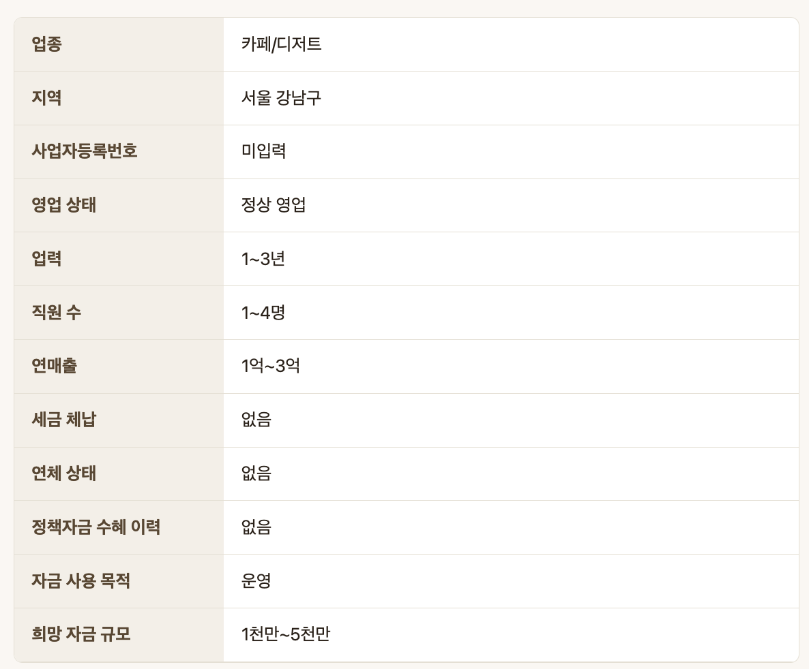
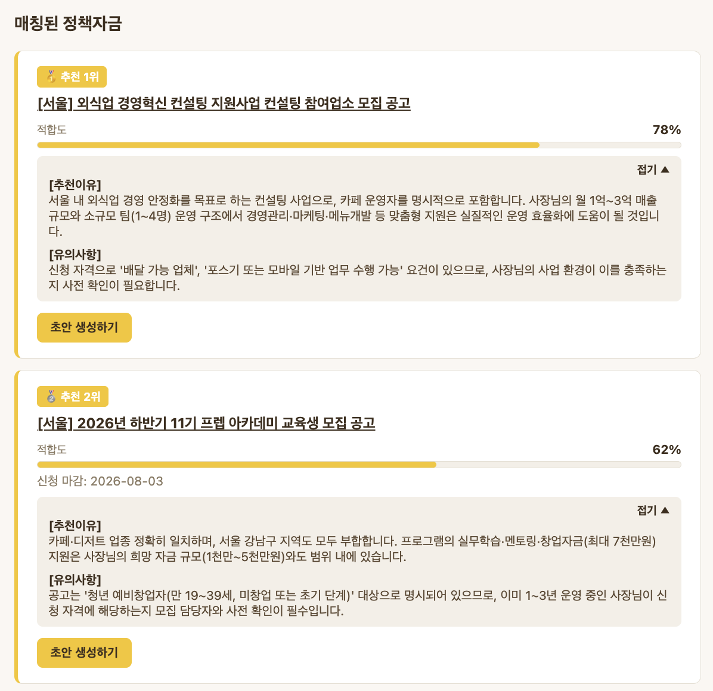
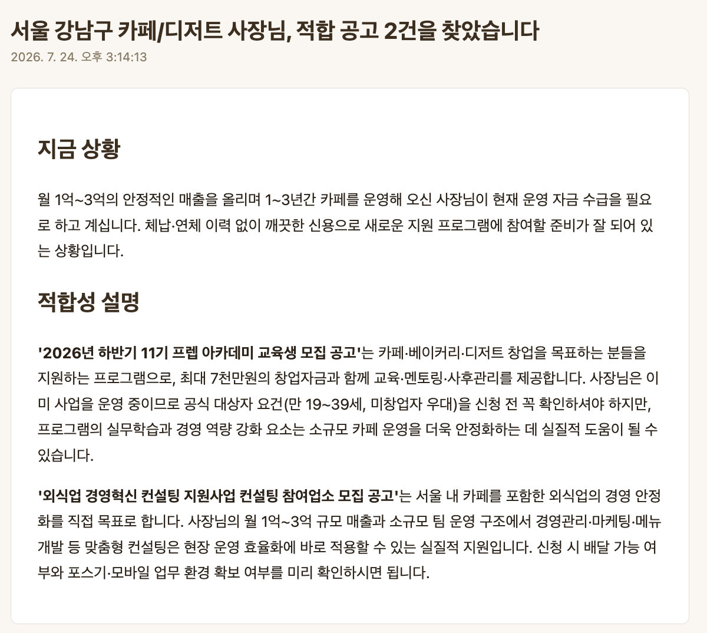

# Opro (Operation pro)

**KB AI Challenge · 팀 Just-it**

소상공인 대상으로 정책자금 지원 공고를 매칭하고, 진단·리포트·신청서 초안까지 자동 생성하는 프로액티브 AI 에이전트입니다.

소상공인이 정책자금을 놓치는 건 정보가 없어서가 아니라, 여러 채널에 흩어져 있고 조건이 바뀌었을 때 먼저 알려주는 주체가 없기 때문입니다. Opro는 사용자가 먼저 찾아보기 전에 진단 결과를 바탕으로 필요 시점을 감지해 먼저 알려주는 구조로 이 문제를 풉니다 — 조회 시점의 스냅샷만 주는 KB의 기존 정적·사용자 주도형 서비스와의 핵심 차이입니다.

---

## 데모

<!-- TODO: 데모 GIF/영상 링크 -->

| 온보딩 | 정책자금 매칭 | 리포트 |
| --- | --- | --- |
|  |  |  |

---

## 핵심 기능

- **온보딩 — 개인화된 재확인**: 선택형 질문으로 프로필을 수집하되, 체납·연체처럼 응답 신뢰도가 낮은 항목은 모호도에 따라 분기되는 꼬리질문으로 재확인합니다. 끝내 확인되지 않은 값은 매칭 근거로 쓰지 않습니다.
- **공고 수집·색인**: 기업마당 공고를 매일 전량 수집하며, 개별 공고 파싱 실패가 배치 전체를 막지 않습니다. 키워드 색인(Kiwi)은 매일 재구성, 벡터 색인(Chroma)은 신규 건만 증분 반영합니다.
- **매칭 엔진(4단계)**: 쿼리 변환(Haiku)+하이브리드 검색(BM25∥벡터, RRF 융합) → 지역·업종 하드필터 → LLM 재판정(Sonnet) → 부적격 판정 공고는 ai-engine·백엔드 두 지점에서 각각 관련도 점수를 제거해 화면 노출을 차단합니다.
- **진단**: 경기지표와 프로필을 결합해 상황을 진단하고 개인화된 재질문을 생성합니다(Opus). 이 결과는 재질문·검색 쿼리·리포트 세 곳으로 전파되는 파이프라인의 유일한 시작점입니다.
- **리포트**: 프로필 팩트시트는 코드가 결정론적으로 조립하고, 그 위에 언어모델(Sonnet)이 적합성 설명을 합성합니다. 필드 단위 근거로 설명 가능성을 확보합니다.
- **신청서 초안**: 사업개요·신청사유·활용계획·기대효과 4개 섹션을 자동 생성하되, 근거가 부족한 값은 지어내지 않고 기입 위치만 표시합니다.
- **알림·재매칭**: 매시간 활성 프로필을 재매칭해 신규 공고만 알립니다. 리포트는 누적 매칭을 재정렬해 상위 5건을 보여주고 마감 지난 공고는 자동 제외합니다. 카카오 발송 실패는 예외 처리로 격리해 파이프라인에 영향을 주지 않습니다.
- **KB와 함께했을 때**: 데이터 접근 문제가 금융기관 환경에서 구조적으로 해소됩니다 — 상권·매출 데이터 결합으로 선제 감지 강화, 자격 미달 고객을 KB 자체 상품/대환 경로로 연결, 상환·만기·재대출까지 이어지는 자금 생애주기 관리로 확장 가능합니다.

---

## 핵심 차별점 (설계 원칙)

**모델 등급은 "이 단계가 얼마나 어려운가"가 아니라 "이 단계가 틀리면 뒤가 얼마나 틀어지는가"로 정합니다.** 진단(Opus, 1곳)은 결과가 재질문·검색 쿼리·리포트 서사 세 곳으로 그대로 전파되는 유일한 시작점이라 비용을 아끼지 않습니다. 적합성 판단·리포트·신청서 초안(Sonnet, 3곳)은 판단과 서술이 필요한 추론 작업입니다. 쿼리 변환(Haiku, 1곳)은 판단이 아닌 기계적 재작성이라 가장 가벼운 모델로 충분하고, 뒷단(하드필터·LLM 재판정)이 오차를 다시 걸러내 파급 범위도 좁습니다.

**사실관계가 필요한 값은 코드가, 판단이 필요한 부분만 모델이 만듭니다.** 프로필 팩트시트·신청서 사업개요처럼 정확해야 하는 값은 코드가 결정론적으로 조립해 hallucination 여지를 없애고, 적합성 설명·재질문 답변처럼 판단·서술이 필요한 부분만 언어모델이 합성합니다. "확인되지 않은 값은 판정·생성에 쓰지 않는다"는 원칙을 온보딩부터 신청서까지 파이프라인 전체에 일관 적용합니다.

---

## 아키텍처

프론트엔드(Next.js)·백엔드(Spring Boot)·AI 서비스(FastAPI) 3계층 구조입니다. 백엔드가 유일한 데이터 오너이고 AI 서비스는 무상태입니다 — 백엔드에는 언어모델 SDK 의존성을 두지 않아, 서비스 경계를 코드 의존성 수준에서 강제합니다.

### 기술 스택

| 계층 | 기술 |
| --- | --- |
| 프론트엔드 | Next.js 14.2.5, React 18.3.1, TypeScript |
| 백엔드 | Spring Boot 3.3.2, Java 21 |
| AI 서비스 | FastAPI, Python, Anthropic SDK |
| LLM | Claude Opus 4.8 / Sonnet 4.6 / Haiku 4.5 |
| 검색 | rank-bm25, kiwipiepy(한국어 형태소 분석), ChromaDB, bge-m3(1024차원 다국어 임베딩) |
| 데이터베이스 | PostgreSQL 16 |
| 인프라 | Docker Compose (healthcheck 기반 기동 순서 제어) |

### 흐름

- **요청 흐름**: 온보딩 → 진단 → 재질문 → 매칭(하이브리드 검색·하드필터·LLM 재판정) → 리포트 → 저장(단일 트랜잭션) → 알림
- **배치 흐름**: 매일 06:00 공고 수집·색인 재구성, 매시간 프로필 재매칭

### 시스템 아키텍처


### 요청 흐름 시퀀스 다이어그램


---

## 프로젝트 구조

```
opro/
├── apps/
│   ├── api-core/            # Spring Boot 3.3.2(Java 21) — 유일한 데이터 오너
│   │                        #   온보딩·진단·매칭 오케스트레이션·알림·배치 스케줄러
│   ├── ai-engine/           # FastAPI(Python) — 무상태 AI 서비스
│   │                        #   Claude 호출(진단/자격판정/리포트/초안), 하이브리드 RAG, 색인
│   └── web/                 # Next.js 14(App Router) — 온보딩 UI·리포트 뷰어·알림벨
│
├── db/init/                 # PostgreSQL 스키마 단일 소스 (01~12, 번호 순 1회 실행)
│
├── doc/                     # 설계 문서·기술 설명서·테스트 가이드 (아래 "문서" 절 참고)
│
├── docker-compose.yml           # 전체 스택(최초 기동용)
├── docker-compose.web.yml       # web만 재빌드
├── docker-compose.server.yml    # api-core만 재빌드
├── CLAUDE.md / AGENTS.md        # 서비스 경계 원칙 — AI 코딩 하네스(Claude Code/Codex)용 가이드라인
└── .env.example
```

서비스 경계 원칙(누가 무엇의 오너인지, 뭘 하면 안 되는지)의 단일 소스는 `CLAUDE.md`입니다.

---

## 실행 방법

Docker Compose로 5개 서비스(web·api-core·ai-engine·postgres·chroma)를 한 번에 기동합니다. compose 파일이 용도별로 3개 있습니다.

| 파일 | 용도 |
| --- | --- |
| `docker-compose.yml` | 전체 스택(postgres·chroma·ai-engine·api-core·web) — 최초 기동은 이걸로 |
| `docker-compose.web.yml` | web만 재빌드(프론트만 고쳤을 때, 백엔드 스택은 안 건드림) |
| `docker-compose.server.yml` | api-core만 재빌드(백엔드만 고쳤을 때, postgres/chroma/ai-engine은 안 건드림) |

### 1. 환경변수 설정

```bash
cp .env.example .env
```

`.env`에서 채워야 하는 값:

| 변수 | 필수 여부 | 없으면 |
| --- | --- | --- |
| `ANTHROPIC_API_KEY` | 사실상 필수 | 없으면 `MOCK_LLM=true`로 돌려야 함(아래 참고) |
| `BIZINFO_CRTFC_KEY` | 필수 | 정책자금 공고 수집 자체가 스킵됨(매칭할 데이터가 안 생김) |
| `ECOS_API_KEY` | 선택 | 경기지표 수집만 스킵, 나머지 파이프라인은 정상 동작 |
| `POSTGRES_*` / `JWT_SECRET` | 기본값 사용 가능 | `.env.example`의 기본값 그대로 써도 로컬 실행엔 문제없음 |
| `KAKAO_CLIENT_ID` / `KAKAO_CLIENT_SECRET` | 선택(`.env.example`엔 없음, `application.yml` 참고) | 카카오 "나에게 보내기" 알림만 비활성화, 인앱 알림은 정상 동작 |

`MOCK_LLM=true`로 두면 Claude를 실제로 호출하지 않고 각 서비스가 목업 응답을 반환합니다 — 배선(온보딩→진단→매칭→리포트)이 끊김 없이 도는지만 토큰 비용 없이 확인할 때 씁니다.

### 2. 최초 기동

```bash
docker compose up -d --build
```

- `ai-engine`이 뜨기 전까지 `api-core`는 기동을 시작하지 않습니다(healthcheck 체이닝) — 첫 기동은 bge-m3(약 2.3GB) 임베딩 모델을 내려받고 로드하느라 **수 분 정도 걸릴 수 있습니다.** 정상입니다.
- 정책자금 데이터가 하나도 없는 상태로 처음 뜨면, `api-core`가 기동 직후 자동으로 공고를 수집·색인합니다(수동으로 아무것도 안 눌러도 됨).
- 전체가 뜨면 `http://localhost:3000`에서 시작하면 됩니다.

### 3. 개별 서비스만 재빌드(반복 개발 시)

프론트만 고쳤을 때:
```bash
docker compose -f docker-compose.web.yml up -d --build
```

백엔드만 고쳤을 때:
```bash
docker rm -f opro-api-core-1   # docker-compose.yml 쪽 api-core 컨테이너와 포트 충돌 방지
docker compose -f docker-compose.server.yml up -d --build
```

둘 다 `postgres`/`chroma`/`ai-engine`은 건드리지 않습니다 — `docker compose up -d --build`(파일 지정 없이)를 반복 실행하면 이 서비스들까지 콜드스타트되어 매번 몇 분씩 잡아먹으니, 반복 개발 중에는 위 두 명령을 쓰는 걸 권장합니다.

### 접속 주소

| 서비스 | 주소 |
| --- | --- |
| 웹 | http://localhost:3000 |
| API Core | http://localhost:8080 |
| AI 서비스 | http://localhost:8000 |
| PostgreSQL | localhost:5432 |
| Chroma | http://localhost:8001 |

### 주의사항

- **DB를 초기화하고 싶으면** `docker compose down` 후 `pg-data`/`chroma-data` 디렉터리를 지우고 다시 `up -d`하면 됩니다. 재기동 시 정책자금 데이터가 자동으로 다시 수집되므로(위 "최초 기동" 참고) 별도 시드 작업이 필요 없습니다.
- **`hf-cache` 볼륨은 지우지 마세요** — bge-m3 모델 캐시라, 지우면 매번 재다운로드로 기동이 몇 분씩 더 걸립니다.
- 전체 스택 종료: `docker compose down` (볼륨까지 지우려면 `-v` 추가, 단 위 DB 데이터도 같이 날아감)

---

## 문서

### 설계 문서 · 의사결정 기록

| 문서 | 내용 |
| --- | --- |
| [prd.md](doc/planning/prd.md) | 초기 기획서 — 문제 정의, KB 기존 서비스 조사, 목표 |
| [system_flow_overview.md](doc/planning/system_flow_overview.md) | 3개 서비스 전체 흐름·기술 스택 개요 |
| [service_flow.md](doc/flows/service_flow.md) | 사용자 플로우 · 기능 플로우 |
| [funding_request_pivot_design.md](doc/planning/funding_request_pivot_design.md) | 임계값 트리거 → 사용자 주도 매칭으로 전환한 피벗 설계 |
| [dependency_graph01.md](doc/planning/dependency_graph01.md) | 작업 의존성 그래프(병렬 개발 계획 근거) |
| [gap_analysis_01.md](doc/planning/gap_analysis_01.md) | 스펙 대비 실제 구현 갭 분석 |
| [db분석.md](doc/planning/db분석.md) | 전체 테이블 역할 맵 |
| [보고서-전문화-튜닝-계획.md](doc/planning/보고서-전문화-튜닝-계획.md) | 리포트 개인화·전문성 튜닝 계획 |
| [001-notification-channel-kakao.md](doc/decisions/001-notification-channel-kakao.md) | ADR — 알림 채널을 카카오 "나에게 보내기"로 선택한 이유 |
| [002-vectorstore-selection.md](doc/decisions/002-vectorstore-selection.md) | ADR — pgvector 대신 Chroma로 단일화한 근거 |
| [003-startup-readiness-and-sync-report.md](doc/decisions/003-startup-readiness-and-sync-report.md) | ADR — 기동 시 데이터 준비 상태 동기화 설계 |

### 기술 설명서 (대회 제출용 심층 분석)

| 문서 | 내용 |
| --- | --- |
| [technical_specification_2026-07-30.md](doc/2026-07-30/technical_specification_2026-07-30.md) | 예선 평가 기준별 참고 자료(문제해결능력·기술적 완성도) |
| [competition_submission_architecture_2026-07-28.md](doc/2026-07-28/competition_submission_architecture_2026-07-28.md) | 기획 대비 실제 구현 진화 과정 + 전체 아키텍처·DB 스키마 |
| [ai_llm_usage_deep_dive_2026-07-28.md](doc/2026-07-28/ai_llm_usage_deep_dive_2026-07-28.md) | Claude·AI 컴포넌트를 어디서 어떻게 쓰는지 콜사이트별 심층 분석 |
| [external_data_collectors_deep_dive_2026-07-28.md](doc/2026-07-28/external_data_collectors_deep_dive_2026-07-28.md) | 외부 공공데이터 수집기가 실제로 어디서 소비되는지 추적 |
| [harness_parallel_development_process.md](doc/2026-07-28/harness_parallel_development_process.md) | AI 하네스 기반 병렬 개발 프로세스, GitHub 타임스탬프 근거 |
| [no_match_investigation_and_local_reset_flow_2026-07-30.md](doc/2026-07-30/no_match_investigation_and_local_reset_flow_2026-07-30.md) | 매칭 결함(지역 하드필터) 조사·원인·해결 기록 |

### 테스트 · QA

| 문서 | 내용 |
| --- | --- |
| [test_scenario.md](doc/test_scenario.md) | 시연 영상용 온보딩 테스트 케이스 3종 + 촬영 순서 |
| [local_test_guide.md](doc/testing/local_test_guide.md) | 로컬 실행부터 화면 확인까지 워크스루 |
| [checkpoint_test_guide.md](doc/testing/checkpoint_test_guide.md) | 중간점검용 API·DB 테스트 가이드 |
| [checkpoint_frontend_test_guide.md](doc/testing/checkpoint_frontend_test_guide.md) | 브라우저 클릭 기반 테스트 가이드 |
| [카카오-알림-테스트-시나리오.md](doc/testing/카카오-알림-테스트-시나리오.md) | 카카오 알림 수동 재발송 테스트 |
| [qa_S6.md](doc/2026-07-28/qa-reports-examples/qa_S6.md) | QA 리포트 — 알림 API DDL↔Entity 교차검증 |
| [diagnosis_followup_prompt_eval_2026-08-02.md](doc/2026-08-02/diagnosis_followup_prompt_eval_2026-08-02.md) | 진단(콜1) 재질문 프롬프트 실측 베이스라인(골든 프로필 8종) |
| [diagnosis_followup_prompt_eval_v2_2026-08-02.md](doc/2026-08-02/diagnosis_followup_prompt_eval_v2_2026-08-02.md) | 위 평가에서 발견한 문제 조치 후 2차 재검증 |
| [qa_issue29.md](doc/2026-07-28/qa-reports-examples/qa_issue29.md) | QA 리포트 — 임계값 트리거 폐지 피벗 재검증 |
| [qa_ineligible_policy_gate.md](doc/2026-07-28/qa-reports-examples/qa_ineligible_policy_gate.md) | QA 리포트 — 결격 공고 사전 배제 검증 |

---

## 팀 소개

| 이름 | 역할 |
| --- | --- |
| 견희 | Spring 백엔드 + AI |
| 지훈 | 백엔드 / AI |
| 영인 | 프론트엔드 / 문서 |
