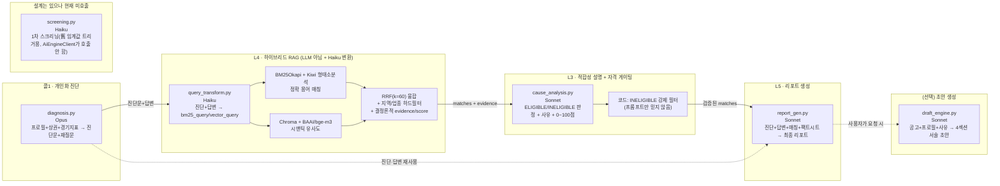

# Claude/LLM 및 AI 컴포넌트 사용 방식 — 에이전틱 관점 심층 분석

> **문서 목적**: `doc/2026-07-28/competition_submission_architecture_2026-07-28.md`(전체 아키텍처·플로우)를 보완해, "이 프로젝트가 AI를 실제로 어떻게 쓰고 있는가"만 따로 깊게 파고든다. Claude 6개 콜사이트를 전부 코드에서 확인했고(`apps/ai-engine/app/services/*.py`, `anthropic_client.py`), 형태소 분석·벡터DB·검색 융합 등 LLM이 아닌 AI 컴포넌트도 함께 정리한다.
> **근거**: 모든 서술은 실제 소스 파일 인용 기준이며 추정치가 아니다.

---

## 1. 이 프로젝트가 "에이전틱"인 이유

한 번의 프롬프트로 답을 뽑아 화면에 뿌리는 "LLM 래퍼"와 이 프로젝트의 차이는 크게 네 가지다.

1. **자율적으로 먼저 움직인다**: 사용자가 아무것도 요청하지 않아도 매시간 배치(`ScheduledJobs.hourlyMatchTrigger`)가 신규 정책자금 공고를 재매칭하고, 새로 매칭된 것만 골라 알림까지 스스로 보낸다. "물어봐야 답하는" 구조가 아니라 "먼저 찾아서 알려주는" 구조.
2. **여러 인지 단계로 쪼개져 있고, 각 단계가 서로 다른 모델/성격의 작업을 맡는다**: 검색(하이브리드 RAG, 규칙기반) → 판단(적합성·자격 평가, Sonnet) → 합성(리포트 작성, Sonnet) → 대화(진단·재질문, Opus)로 역할이 분리돼 있다.
3. **오케스트레이션은 LLM이 아니라 코드가 한다**: ai-engine 안에 ReAct류의 자율 tool-loop는 없다. 어떤 순서로 어떤 모델을 부를지는 전부 Spring(`PipelineService`/`ConsultationService`)이 결정한다 — "LLM은 함수, 흐름 제어는 코드"라는 설계.
4. **LLM 출력을 코드가 항상 재검증한다(이중 방어)**: 프롬프트로 지시한 계약(JSON 스키마, 자격 판정 등)을 LLM이 어겨도 화면까지 새어나가지 않도록, 코드 레벨에서 다시 한번 강제한다. 아래 §5에서 구체적으로 다룬다.

---

## 2. Claude 모델 사용 현황 — 콜사이트별 상세

ai-engine에서 Claude를 호출하는 지점은 정확히 **6곳**이다(전부 `anthropic_client.call()` 공용 함수를 거친다).

| # | 콜사이트 | 모델 | 이 티어를 쓰는 이유 | 입력 | 출력 계약(JSON) | 코드 레벨 방어장치 |
|---|---|---|---|---|---|---|
| 1 | **콜1 개인화 진단**<br/>`POST /diagnose`<br/>(`diagnosis.py`) | **Opus**<br/>`claude-opus-4-8` | 온보딩 응답만으로 정성적 경영 진단과, 이후 대화 전체 방향을 결정할 재질문을 설계 — 대화 품질을 좌우하는 단발성 고위험 호출이라 품질 최우선 | 값이 채워진 프로필 필드만 + `market_context`(선택) + `econ_context`(선택) + `profile_facts`(결정론적 팩트시트) | `{"diagnosis": str, "follow_up_questions": [{"id","question","type":"choice"|"text","options"?}]}` | 코드펜스 제거 → 첫 `{`~마지막 `}` 슬라이스 → 잘못된 이스케이프(`\'`) 정규식 정리 → 그래도 실패하면 `{"diagnosis": raw, "follow_up_questions": []}` 폴백. `prefill="{"` 구조적 강제를 시도했으나 Opus가 `400 invalid_request_error`를 반환해 **폐기**하고 프롬프트 경고+관대한 파싱으로 대체(코드 주석에 기록) |
| 2 | **L2 1차 스크리닝**<br/>`POST /screen`<br/>(`screening.py`) | **Haiku**<br/>`claude-haiku-4-5` | 이진 분류(알림 가치가 있는가)뿐이라 최저비용 모델로 충분 | `signal_summary: str` | `{"worth_alerting": bool}` | `max_tokens=5`로 응답 자체를 극소화 |
| 3 | **L4 쿼리 변환**<br/>(`rag/query_transform.py`, `/matching` 내부) | **Haiku**<br/>`claude-haiku-4-5` | 판단이 아니라 텍스트 재작성(키워드형/자연어형 변환)일 뿐이라 저비용 모델로 충분 | `cause_text` + 프로필 힌트(지역·업종) | `{"bm25_query": str, "vector_query": str}` | 파싱 실패 시 `cause_text`를 두 쿼리에 그대로 사용(`fallback: true`) — 검색 자체가 죽지 않게 |
| 4 | **L3 적합성 설명 + 자격 게이팅**<br/>`POST /analysis`<br/>(`cause_analysis.py`) | **Sonnet**<br/>`claude-sonnet-4-6` | 매칭된 공고별로 "자격 있는가/왜 맞는가/점수는 몇 점인가"를 동시에 판단하는 핵심 추론 단계 | profile + matches + market_context(선택) + profile_facts(선택) + follow_up_answers(선택) | `{"fit_text": str, "match_eligibility": {pblancId: "ELIGIBLE"\|"INELIGIBLE"\|"UNCERTAIN"}, "match_rationales": {pblancId: {"reason","caveats"}}, "match_relevance": {pblancId: 0~100}}` | **코드가 `match_eligibility=INELIGIBLE`인 `pblancId`의 `match_relevance`를 무조건 강제 삭제** — 코드 주석: "프롬프트만으로 계약을 보장하지 않는다"(이슈 #124) |
| 5 | **L5 리포트 생성**<br/>`POST /report/generate`<br/>(`report_gen.py`) | **Sonnet**<br/>`claude-sonnet-4-6` | 여러 입력(적합성 설명·팩트시트·진단·답변)을 하나의 신뢰 가는 문서로 **합성**하는 고차 작업 | fit_text + matches(경량) + profile_summary + profile_facts(선택) + diagnosis(선택) + follow_up_answers(선택) | `body_md`(마크다운 문자열 — 자유서술이지만 헤더 구조는 강제) | 900자 캡, "정직한 헤더 건수"(화면 카드 수와 항상 일치) 규칙, `#`/`##` 마크다운 헤더 리터럴 강제, "진단 그대로 반복 금지" 지시 |
| 6 | **신청서 초안 생성**<br/>`POST /draft`<br/>(`draft_engine.py`) | **Sonnet**<br/>`claude-sonnet-4-6`(전용 모델 키 없이 `model_reasoning` 재사용) | 공고 요구사항을 해석해 서술형 문장을 새로 작성하는 생성 작업 | announcement + profile + cause_text | `{"사업개요","신청사유","활용계획","기대효과"}` | 모르는 값은 지어내지 말고 `[여기에 ○○ 기입]` placeholder로 남기라고 명시 지시. 파싱 실패 시 `{"raw": raw}` 폴백 |

### 모델 티어링 원칙

```
Opus (claude-opus-4-8)     — 1곳: 콜1 진단. "전체 대화의 방향을 정하는" 가장 비싼·희소한 호출 1회에만 최고 티어 투입
Sonnet (claude-sonnet-4-6) — 3곳: 적합성판단·자격게이팅, 리포트 합성, 초안 생성. 추론/합성 비중이 높은 작업
Haiku (claude-haiku-4-5)   — 2곳: 1차 스크리닝, 쿼리 변환. 기계적 변환·이진분류처럼 판단 부담이 낮은 작업
```

비용이 아니라 **"이 단계가 틀리면 이후 전부가 틀어지는가"**를 기준으로 모델을 배분한 것이 특징이다 — 콜1(진단)이 이후 재질문·매칭·리포트 전체의 입력이 되기 때문에 유일하게 Opus를 쓴다.

---

## 3. LLM 호출 공통 인프라 (`services/anthropic_client.py`)

6개 콜사이트가 전부 이 한 함수(`call(model, system, user, max_tokens, cache_system=True, prefill=None)`)를 거친다.

- **프롬프트 캐싱(기본 활성)**: `system_block[0]["cache_control"] = {"type": "ephemeral"}` — 시스템 프롬프트(각 단계별로 길고 반복되는 지시문)를 캐시해 반복 호출 비용을 낮춘다. `cache_system` 파라미터로 끌 수 있지만 기본값이 `True`라 사실상 전 호출에 적용.
- **prefill 구조(설계는 있으나 현재 미사용)**: assistant 턴을 `"{"`로 미리 채워 JSON 이탈 자체를 구조적으로 막는 기법을 구현해뒀지만, 실측 결과 **`claude-opus-4-8`가 prefill 시 400 에러를 반환**해 실제 콜사이트 어디에서도 `prefill=`을 넘기지 않는다(6개 서비스 파일 전수 grep 확인). 대신 프롬프트 경고("반드시 JSON만 출력") + 관대한 파싱 체인으로 방어한다.
- **토큰 사용량 로깅**: 매 호출마다 `input_tokens`/`output_tokens`/`cache_read_input_tokens`/`cache_creation_input_tokens`를 로그로 남겨, 캐시 히트율과 비용을 실측 가능하게 해둠(이슈 #61 — "감이 아니라 숫자로").
- **응답 잘림 감지**: `stop_reason == "max_tokens"`이면 경고 로그를 남긴다 — 잘린 JSON이 파싱 실패로 이어지는 문제(이슈 #104)를 모든 호출자에 공통 적용.
- **`MOCK_LLM` 토글**: 환경변수 하나로 6개 서비스 전부가 동시에 Claude 호출 없이 `[MOCK]` 접두어가 붙은 계약-일치 목업을 반환하도록 분기한다. 배선(엔드투엔드 연결) 검증 시 토큰 비용 없이 확인 가능.

---

## 4. "에이전틱" 설계 패턴

| 패턴 | 이 프로젝트에서의 구현 |
|---|---|
| **자율 트리거** | `ScheduledJobs.hourlyMatchTrigger()` — 사용자 요청 없이 매시간 프로필을 재매칭. `profile_funding_alert`로 이미 알린 조합은 걸러 신규 매칭만 처리 |
| **다단계 파이프라인, 오케스트레이션은 코드** | L4(검색)→L3(판단)→L5(합성) 순서와 각 단계 간 데이터 전달을 `PipelineService`/`ConsultationService`(Spring)가 지휘. ai-engine 쪽엔 자율 tool-loop가 없다 |
| **이중 방어(코드가 LLM 계약을 재검증)** | L3의 INELIGIBLE 강제 필터링(§2-#4), 마감일 D-day는 LLM 추정이 아니라 `_deadline_note()`로 결정론적 계산, 헤더 개수는 실제 매칭 건수와 항상 일치하도록 프롬프트+구조 동시 강제 |
| **결정론과 생성의 분리** | 개인화 헤더 접두사(`_personal_prefix()`)는 LLM이 아니라 코드가 profile_summary에서 직접 조립. 매출 등 정밀 수치는 `profile_facts`(코드가 만든 팩트시트)를 LLM이 우선하도록 지시 — "LLM이 틀릴 수 있는 값은 최대한 코드가 계산해서 근거로 준다" 원칙 |
| **멀티턴 대화형 상호작용** | 단발 온보딩→리포트가 아니라, 진단(콜1)을 먼저 보여주고 부족한 정보를 재질문으로 되물은 뒤(사용자 응답 대기) 그 답을 반영해 전문화(콜2)하는 2턴 구조. "질문이 부족하면 스스로 더 묻는다"는 점이 핵심 |
| **비용 티어링 + 캐싱 + Mock 전환** | 위 §2/§3 |

---

## 5. Non-LLM AI 컴포넌트 — 하이브리드 검색(L4)

정책자금 매칭은 Claude 호출 이전에 **LLM이 아닌 두 검색 엔진의 앙상블**로 후보를 추린다.

### 5-1. 형태소 분석 — Kiwi (`kiwipiepy`)

```python
_kiwi = Kiwi()
def tokenize(text):
    return [t.form for t in _kiwi.tokenize(text)
            if t.tag.startswith(("N", "SN", "SL", "V"))]
```

- 한국어는 교착어라 어절 단위로만 토큰화하면 "정책자금을"과 "정책자금이"가 다른 단어로 취급돼 BM25 같은 정확 매칭 방식의 검색 품질이 크게 떨어진다.
- Kiwi로 형태소 분석 후 **체언류(N)·숫자(SN)·외국어(SL)·용언류(V)** 태그만 남기고 조사·어미·기타 허사를 제거 — "검색에 의미 있는 형태소만" 남기는 전처리.

### 5-2. BM25 (`rank_bm25.BM25Okapi`)

- Kiwi로 토큰화한 공고 본문 전체를 `BM25Okapi`로 인덱싱, 프로세스 메모리에만 상주(별도 영속 저장소 없음).
- `/index/rebuild` 호출마다(배치 06:00, 또는 수동 트리거) 활성 공고 전체로 **전량 재계산** — 형태소 분석+토큰화만 하면 되는 가벼운 연산이라 매번 새로 만들어도 부담이 적음.
- **강점**: 마감일·금액 등 정확한 용어/숫자 매칭.

### 5-3. 벡터 검색 — BAAI/bge-m3 + Chroma

```python
_embedding_function = embedding_functions.SentenceTransformerEmbeddingFunction(
    model_name=settings.embedding_model)  # "BAAI/bge-m3"
```

- 1024차원 다국어 임베딩 모델을 **명시적으로 지정** — 지정하지 않으면 Chroma 기본값(`all-MiniLM-L6-v2`, 영어 특화)이 한국어 공고를 임베딩해 시맨틱 축이 열화되는 것을 의도적으로 방지(코드 주석에 이 위험이 직접 명시돼 있음).
- Chroma는 HTTP 클라이언트로 별도 컨테이너에 접속. **증분 upsert** — 기존 컬렉션의 id를 먼저 조회해 신규 id만 청크(50개) 단위로 임베딩·업서트한다. 재기동마다 전체를 다시 임베딩하면 bge-m3 로딩(2GB급 CPU 모델) 비용 때문에 Docker 헬스체크 `start_period`를 넘겨버리는 문제가 있었기 때문(코드 주석에 기록된 실측 배경).
- **강점**: 표현이 달라도 의미가 통하는 공고를 찾아내는 시맨틱 유사도.

### 5-4. RRF (Reciprocal Rank Fusion, k=60) — 앙상블 지점

- BM25 순위와 벡터 순위를 각각 `1/(60+rank)`로 점수화해 합산, 하나의 순위로 융합.
- 이후 **결정론적 하드필터**(지역 일치 — 시/도·시/군구·"전국" 처리, 업종 일치 — 토큰 겹침 + 제외 키워드 리스트)가 적용된다 — 이 필터는 LLM이 아니라 순수 규칙.

### 5-5. 결정론적 evidence/score(L4) → LLM 재평가(L3)의 2단 구조

- L4 단계에서 이미 **규칙 기반으로** `evidence`(JSON: `{"reason","caveats"}`)와 0~100 매칭 점수를 코드가 직접 조립한다(지역 일치/업종 일치/체납·연체 리스크 경고 3항목 체크리스트).
- 이 결과가 L3(Sonnet)에 다시 전달되고, LLM이 **더 정교한 사유·자격판정·관련도 점수**로 재평가한다.
- 즉 "값싼 규칙 기반 1차 신호 → 비싼 LLM 2차 정제"의 2단 구조 — RAG 결과를 곧바로 사용자에게 보여주지 않고 반드시 LLM 판단을 한 번 더 거치게 한다.

### 5-6. 순수 외부 API 연동 (AI 아님, 구분 필요)

- **국세청 사업자등록 상태조회**(odcloud API) — 온보딩 중 사업자번호 검증에 실사용.
- **국민연금 가입 사업장 내역 API** — 온보딩 직원수 질문의 기본값 제시용.
- 둘 다 규칙/조회 기반이며 AI/LLM 요소가 전혀 없다 — "이 프로젝트의 AI"를 설명할 때 혼동하지 않도록 구분해서 표기.

---

## 6. 전체 그림 — LLM 콜 지도



---

## 7. 조사 중 발견한 사실 — 설계됐지만 현재 활성 경로에 없는 것들

1. **`/screen`(L2 1차 스크리닝, Haiku)은 라우터와 서비스가 모두 존재하지만, `AiEngineClient`(Spring)의 6개 메서드 목록에 대응 호출이 없다.** 이슈 #29 이전 임계값 트리거 구조(고비용 판단 전 저비용 사전 필터)의 흔적으로, 현재 활성 파이프라인(콜1 진단 → 콜2 전문화)에서는 호출되지 않는다.
2. **`prefill` 구조적 JSON 강제 기법은 인프라에 구현돼 있지만 6개 콜사이트 어디에서도 쓰이지 않는다.** Opus가 400 에러를 반환한다는 실측 결과 때문에 폐기됐고, 다른(Sonnet/Haiku) 콜사이트로도 확장 적용되지 않은 상태 — 필요하다면 Opus 외 콜사이트에는 적용을 검토해볼 여지가 있다.

두 사실 모두 기능 결함은 아니며, "한 번 설계했다가 실측 후 다른 방어 전략으로 대체한" 정상적인 엔지니어링 흔적이다.
