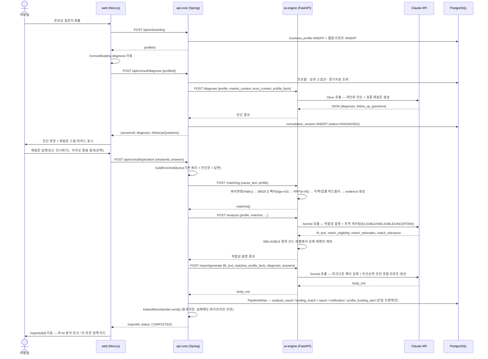
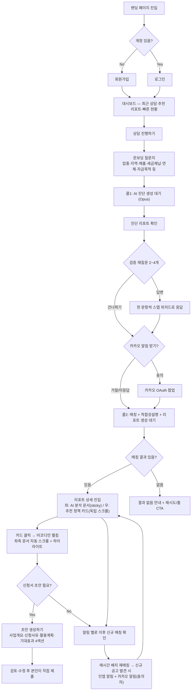
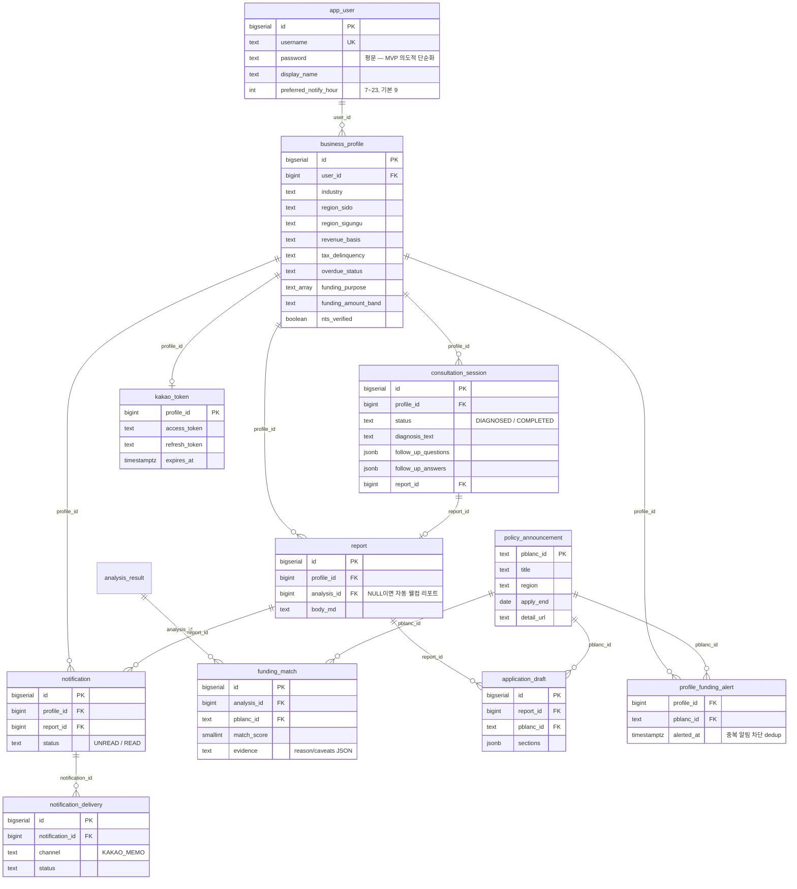

# 소상공인 금융 지원 에이전트 — 아키텍처·플로우 심층 분석

> **문서 목적**: 초기 기획서(v1.2 PRD) 대비 실제 구현이 여러 차례 피벗을 거쳤기 때문에, 대회 제출 시점(2026-07-28) 기준으로 "지금 코드가 실제로 어떻게 동작하는가"를 코드 근거와 함께 재정리한다.
> **작성 방법**: `apps/api-core`, `apps/ai-engine`, `apps/web` 3개 서비스의 실제 소스코드(컨트롤러·서비스·라우터·DB 스키마)를 직접 조사해 검증했다. 저장소 안의 다른 설계 문서(`doc/planning/system_flow_overview.md` 등)는 과거 시점 스냅샷이라 실제 코드와 다른 부분이 있어, 이 문서는 **코드를 최종 근거로 삼는다.**

---

## 1. 왜 "많이 바뀌었는가" — 기획 대비 진화 과정

이 프로젝트는 4주 해커톤 일정 동안 **최소 세 번의 큰 방향 전환**을 거쳤다. 각 전환은 임의 변경이 아니라 문서화된 이유가 있다.

### 1-1. 초기 기획 (v1.2 PRD, `doc/planning/prd.md`)

- **핵심 컨셉**: 상권·경기지표·소비트렌드·정책자금 4개 데이터 축을 상시 모니터링하다가, 업종별 **임계값(threshold)을 초과하는 이벤트**(반경 500m 내 동일업종 신규 개업 3건 이상 등)가 발생하면 에이전트가 먼저 개입하는 **능동형(proactive) 구조**.
- 파이프라인: `온보딩 → 원인 분석(Claude) → 정책자금 매칭(RAG) → 리포트 생성 → 신청서류 초안 → 자동 알림`.
- 온보딩은 자유서술형이 아닌 **폐쇄형(객관식) 9문항**으로 설계(§4-1) — 완료율 확보가 목적.

### 1-2. 2주차 갭 분석 (`doc/planning/gap_analysis_01.md`, 2026-07-14)

이 시점엔 PRD 그대로 **`TriggerEngine` + `threshold_rule` 임계값 트리거가 실제로 구현**되어 있었다. 다만 알림 API·evidence 생성·notification insert 등 15개 항목이 미구현/버그 상태였고, 이후 각각 이슈로 분리되어 순차 해결됐다(`dd2e69f`, `6fb16d8`, `b029cb3`, `db1db89`, `4ad388c` 등 — 커밋 로그 기준).

### 1-3. 이슈 #29 피벗 — 임계값 트리거 전면 폐지 (2026-07-19~21, 실제 구현 완료)

`doc/planning/system_flow_overview.md`가 "구현 전 목표 아키텍처"로 처음 문서화했고, 커밋 `08ee23d`로 실제 구현됐다.

- **왜 바꿨나**: 상권·경기지표(`econ_indicator`)는 전국 단일 계열이라 "개인화된 트리거"로 쓰기 어렵다는 판단. "경영 위기를 감지해서 알려준다"가 아니라 **"당신에게 맞는 자금이 있다/새로 나왔다"**를 유일한 트리거로 단순화.
- **무엇이 바뀌었나**:
  - `TriggerEngine`/`threshold_rule` 평가 로직 완전 제거. 온보딩 직후 **프로필 기반 즉시 매칭**(`ProfileMatchTrigger`)으로 대체.
  - 신규 테이블 `profile_funding_alert`(06번 마이그레이션) — "이 프로필에게 이 공고를 이미 알렸는가"를 기록하는 dedup 게이트. 예전의 `trigger_event.dedup_key` 방식을 대체.
  - L3(`cause_analysis.py`)의 역할이 "지표가 왜 이렇게 나왔는지 설명"에서 **"이 공고가 왜 이 프로필에 맞는지 설명"**으로 재정의.
  - `market_snapshot`(상권 데이터)은 트리거 자격을 잃고 **매칭 근거 보강용**으로 격하. `econ_indicator`는 트리거 조인에서는 빠졌지만 **완전히 폐기되지는 않았다** — 아래 §1-4에서 다시 살아난다.

### 1-4. 대화형 2-콜 컨설팅 도입 (2026-07-24, `docs/superpowers/plans/2026-07-24-interactive-two-call-consultation.md`)

이슈 #29 직후엔 "온보딩 제출 → 그 자리에서 자동 리포트"였다. 여기서 한 번 더 바뀐다.

- **왜 바꿨나**: 자동 생성 리포트가 사장님의 실제 상황을 다 반영하지 못하는 문제. "사장님이 진단을 읽고, 부족한 정보를 재질문으로 채운 뒤, 그걸 반영한 전문 리포트를 받는" 대화형 흐름이 더 정확하고 개인화된 결과를 만든다는 판단.
- **무엇이 바뀌었나**:
  - 신규 테이블 `consultation_session`(11번 마이그레이션 — 09로 만들었다가 번호 충돌로 11로 재배치된 이력이 커밋에 남아있다: `7fd0b37`).
  - **콜1** `POST /api/consult/diagnose` — 프로필+상권+경기지표로 Claude **Opus**가 개인화 진단문 + 검증 재질문(2~4개, 객관식/서술형) 생성. 여기서 `econ_indicator`가 "트리거"가 아니라 **"진단 컨텍스트"**로 부활한다 — `EcosCollector`는 폐기되지 않고 배치에서 계속 돌며 이 진단 컨텍스트를 채운다.
  - 사장님이 재질문에 답변(또는 건너뛰기).
  - **콜2** `POST /api/consult/specialize` — 기존 매칭→적합성설명→리포트 파이프라인을 **그대로 재사용**하되, 쿼리에 진단문+답변을 덧붙여 더 정확한 매칭을 유도.
  - 이후 커밋들(`2c703ea` 재질문 스텝 위저드화, `e6bd02d`/`1e22c87` 등)로 UX가 계속 다듬어짐. 온보딩 제출 직후의 옛 "즉시 자동 매칭" 코드는 커밋 `6ecac22`로 완전히 걷어냈다.

### 1-5. 리포트 개인화 고도화 P1~P3 (2026-07-25)

- **P1** (`5455f3e`): `profile_facts` — 결정론적으로 조립한 프로필 팩트시트를 LLM에 함께 전달해, 매출 월/연 단위를 LLM이 잘못 해석해 오표기하는 문제를 근본 차단.
- **P2** (`63e5c7a`): 콜1의 진단문·재질문 답변을 콜2의 리포트 생성 프롬프트에도 그대로 흘려보내, "사장님이 답한 것 → 리포트 결론"의 연결을 눈에 보이게 만듦.
- **P3** (`30a7e6c`): 매칭 건별 적합도·유의사항 유무(`matches_brief`)를 근거로 리포트 말미에 **"다음 한 걸음"** 우선순위 조언을 강제하고, 헤더의 건수 표기가 화면 카드 건수와 항상 일치하도록 "정직한 헤더" 규칙을 강화.

### 1-6. 스코프 밖이던 항목의 실제 도입

PRD는 인증·카카오톡 알림을 "스코프 외/확장 로드맵"으로 명시했지만, 둘 다 실제로 구현됐다.

- **인증** (`6a06404`): 평문 id/pw 회원가입·로그인. 해싱·세션·JWT 없이 의도적으로 단순화했고, 코드 주석(`AuthController.java`)에 "사용자 명시 요청"이라고 남아있다 — 해커톤 MVP 범위의 명확한 트레이드오프.
- **카카오 알림** (`doc/decisions/001-notification-channel-kakao.md`): "소상공인은 카톡에 산다"는 통찰로 웹 실시간 알림(SSE/WebSocket) 대신 **카카오 "나에게 보내기" API**를 선택. 인앱 폴링(P1, 필수)과 계층화해 카톡 발송이 실패해도 데모가 죽지 않게 설계. 이후 카카오 동의 시점을 여러 화면에 흩어놨다가, 최종적으로 **컨설팅 대기 화면 하나로 통합**(`e821c35`).

### 1-7. UI/UX 전면 리디자인 (2026-07-25~28, 이번 세션 포함)

기능 파이프라인이 안정화된 뒤, KB Financial·Toss·Stripe·Notion·Linear를 레퍼런스로 화면을 전면 재작업했다.

- 로그인 전 랜딩: 캐릭터 일러스트 히어로 + 임베디드 로그인 카드, 8px 스페이싱 시스템.
- 로그인 후 대시보드: 히어로 축소, 실데이터 기반 "빠른 현황"(제출 질문지/받은 리포트/안읽은 알림) + "최근 상담"·"추천 리포트" 패널.
- 리포트 상세: Notion AI/Copilot Workspace류의 **좌우 연결된 워크스페이스** — 좌측은 sticky + 내부 스크롤되는 "AI 분석 문서", 우측은 독립 스크롤되는 아코디언형 정책 카드 리스트. 카드를 클릭하면 좌측 문서에서 해당 공고가 언급된 문단을 찾아 스크롤+하이라이트하는 "연결" 인터랙션까지 구현.

### 1-8. 요약 표 — 무엇이 왜 바뀌었나

| 영역             | 초기 기획(v1.2 PRD)                                     | 현재 구현                                                                                                          | 전환 계기                                                              |
| ---------------- | ------------------------------------------------------- | ------------------------------------------------------------------------------------------------------------------ | ---------------------------------------------------------------------- |
| 핵심 트리거      | 4축 상시 모니터링 + 임계값(threshold_rule) 초과 시 발동 | 온보딩 직후 프로필 기반 즉시 매칭(`ProfileMatchTrigger`) + 매시간 배치 재매칭, `profile_funding_alert`로 중복 차단 | 이슈 #29 — 전국 단일계열 지표는 개인화 트리거로 부적합                 |
| L3의 역할        | "지표가 왜 이렇게 나왔는지" 원인 분석                   | "이 공고가 왜 이 프로필에 맞는지" 적합성 설명 + 자격 게이팅(ELIGIBLE/INELIGIBLE/UNCERTAIN)                         | 이슈 #29, 이후 이슈 #124(결격 공고 사전 배제)                          |
| 온보딩 이후 흐름 | 온보딩 → 즉시 자동 리포트                               | 온보딩 → 콜1 개인화 진단(Opus) → 재질문 스텝 위저드 → 콜2 전문화 리포트                                            | 대화형 컨설팅이 자동 리포트보다 정확하고 개인화됨                      |
| 리포트 품질      | 매칭 근거 위주                                          | P1(팩트시트로 오표기 방지)·P2(진단·답변 서사 반영)·P3(우선순위 조언+정직한 헤더)                                   | 리포트 신뢰도·개인화 체감 강화                                         |
| 인증             | 스코프 외(profileId 전환으로 시연)                      | 실제 회원가입/로그인(평문 id/pw, MVP 의도적 단순화)                                                                | 다중 사용자 데모 필요                                                  |
| 알림 채널        | 폴링 + "확장 로드맵"                                    | 인앱 30초 폴링(P1 필수) + 카카오 나에게 보내기(P1.5, 동의는 컨설팅 대기화면 하나로 통합)                           | "사용자가 매일 우리 앱을 연다"는 가정 자체가 기존 KB 서비스의 한계였음 |
| 상권/경기지표    | 트리거의 핵심 축                                        | 트리거에서는 배제, 진단·매칭 근거 보강용으로 격하(수집기는 계속 가동)                                              | 개인화 안 되는 전국 단일 지표를 트리거로 쓰지 않기로 결정              |
| 화면/UX          | 기획서에 상세 없음                                      | 랜딩/대시보드/리포트 상세를 Notion·Linear·Stripe류 워크스페이스로 다단계 리디자인                                  | 기능 파이프라인 안정화 후 제품 완성도 투자                             |

---

## 2. 현재 기술 스택

| 레이어                   | 기술                                                                                                                                                                                           | 비고                                                                                                                                                                                                                   |
| ------------------------ | ---------------------------------------------------------------------------------------------------------------------------------------------------------------------------------------------- | ---------------------------------------------------------------------------------------------------------------------------------------------------------------------------------------------------------------------- |
| **web**                  | Next.js 14.2.5 (App Router) · React 18.3.1 · TypeScript                                                                                                                                        | 전 페이지 클라이언트 컴포넌트(`"use client"`). 별도 CSS 프레임워크 없이 인라인 스타일 + 컴포넌트-로컬 `<style>` 블록. 세션은 `localStorage`(`bizagent_session`)                                                        |
| **api-core**             | Spring Boot 3.3.2 · Java 21 (Gradle toolchain)                                                                                                                                                 | `spring-boot-starter-web/data-jpa/webflux/validation`. JPA 엔티티는 `AppUser`/`BusinessProfile`/`Report`/`Notification` 4개뿐 — 나머지 8개 이상 테이블은 `JdbcTemplate` 직접 SQL로 관리(조인이 많거나 일회성인 테이블) |
| **api-core → ai-engine** | Spring WebFlux `WebClient`(동기 `.block()`), 240초 타임아웃                                                                                                                                    | `AiEngineClient` 하나가 6개 엔드포인트(`/diagnose`, `/matching`, `/analysis`, `/report/generate`, `/draft`, `/index/rebuild`) 전담                                                                                     |
| **ai-engine**            | FastAPI · Python · `pydantic-settings`                                                                                                                                                         | `anthropic>=0.34` SDK. 7개 라우터(진단/스크리닝/적합성설명/매칭/리포트/초안/인덱싱)                                                                                                                                    |
| **LLM 모델 라우팅**      | `claude-opus-4-8` — 콜1 개인화 진단(품질 최우선)<br/>`claude-sonnet-4-6` — L3 적합성설명·L5 리포트·초안 생성(추론 품질 우선)<br/>`claude-haiku-4-5-20251001` — L2 스크리닝·L4 쿼리변환(저비용) | `MOCK_LLM` 환경변수로 전 서비스 동시 토글 가능 — 배선 검증 시 토큰 비용 없이 확인                                                                                                                                      |
| **하이브리드 검색(L4)**  | `rank-bm25`(Okapi) + `kiwipiepy`(한국어 형태소분석) ∥ ChromaDB + `sentence-transformers`(`BAAI/bge-m3`, 1024차원 다국어 임베딩) → **RRF(k=60)** 융합                                           | 지역/업종 하드필터 + evidence(`reason`/`caveats`) 및 결정론적 점수는 L4에서 생성, LLM 기반 재평가(자격 게이팅 포함)는 L3에서 별도 수행 — 이중 방어 구조                                                                |
| **DB**                   | PostgreSQL 16, 단일 스키마 소스 `db/init/01~11.sql`(누적 11개 파일)                                                                                                                            | pgvector는 ADR 002로 제거하고 Chroma로 단일화                                                                                                                                                                          |
| **인프라**               | Docker Compose 2계열 — backend(`postgres`/`chroma`/`ai-engine`/`api-core`) + 별도 `web`                                                                                                        | `ai-engine` healthcheck → `api-core` `depends_on: service_healthy` 체이닝. `StartupDataSeeder`가 최초 기동 시 공고 0건이면 자동 수집                                                                                   |
| **알림**                 | 인앱 폴링(`NotificationBell`, 30초 간격) + Kakao "나에게 보내기" OAuth(`KakaoOAuthController`/`KakaoMemoSender`)                                                                               | `NotificationSender` 인터페이스로 채널 추상화 — 발송 실패가 파이프라인을 죽이지 않음                                                                                                                                   |
| **스케줄러**             | Spring `@Scheduled` — 매일 06:00 수집+인덱싱, **매시간** 정각 프로필 재매칭(계정별 `preferred_notify_hour`와 현재 시각이 일치하는 프로필만 대상)                                               |                                                                                                                                                                                                                        |

---

## 3. 시스템 아키텍처

```mermaid
flowchart TB
    subgraph WEB["web · Next.js 14 App Router (:3000)"]
        W_LAND["/ — 랜딩(로그아웃) · 대시보드(로그인)"]
        W_ONB["/onboarding — 질문지 위저드"]
        W_C1["/consult/loading-diagnosis — 콜1 대기"]
        W_C2["/consult/[sessionId] — 진단·재질문·콜2 대기"]
        W_REPORT["/reports/[id] — 2단 워크스페이스"]
        W_BELL["NotificationBell — 30초 폴링"]
    end

    subgraph SPRING["api-core · Spring Boot 3.3.2 / Java 21 (:8080) — 유일한 데이터 오너"]
        AUTH[AuthController]
        ONB[OnboardingController]
        CONSULT["ConsultationController<br/>+ConsultationService"]
        TRIG["ProfileMatchTrigger<br/>(舊 TriggerEngine 대체, 이슈#29)"]
        PIPE["PipelineService + PipelineWriter<br/>(단일 트랜잭션)"]
        SCHED["ScheduledJobs<br/>06:00 수집·인덱싱 / 매시 재매칭"]
        SEED[StartupDataSeeder]
        REP[ReportController]
        NOTI[NotificationController]
        KAKAO["KakaoOAuthController<br/>KakaoMemoSender"]
        COLLECT["Collectors<br/>Bizinfo · ECOS · Sbiz"]
        CLIENT[AiEngineClient]
    end

    subgraph AI["ai-engine · FastAPI (:8000) — stateless AI 전용"]
        DIAG["/diagnose — Opus<br/>콜1 개인화 진단+재질문"]
        MATCH["/matching — L4<br/>하이브리드 RAG (BM25∥벡터→RRF)"]
        ANALYSIS["/analysis — L3, Sonnet<br/>적합성 설명 + 자격 게이팅"]
        REPORTGEN["/report/generate — L5, Sonnet<br/>P1·P2·P3 개인화 리포트"]
        DRAFT["/draft — Sonnet<br/>신청서 초안 4섹션"]
        IDX["/index/rebuild<br/>BM25 + Chroma 증분 재구성"]
    end

    subgraph DATA["데이터 계층"]
        PG[("PostgreSQL 16<br/>db/init 01~11")]
        CHROMA[("Chroma<br/>BAAI/bge-m3 임베딩")]
    end

    subgraph EXT["외부"]
        ANTH["Anthropic Claude<br/>Opus 4.8 / Sonnet 4.6 / Haiku 4.5"]
        BIZINFO[기업마당 Bizinfo API]
        ECOS[한국은행 ECOS API]
        SBIZ[소진공 상권정보 API]
        KAKAOAPI[Kakao 나에게 보내기 API]
    end

    W_ONB -->|POST /api/onboarding| ONB --> PG
    W_C1 -->|POST /api/consult/diagnose| CONSULT
    CONSULT -->|프로필+상권+경기지표 조립| CLIENT
    CLIENT -->|POST /diagnose| DIAG --> ANTH
    CONSULT --> PG

    W_C2 -->|POST /api/consult/specialize| CONSULT
    CONSULT -->|쿼리조립: 프로필+진단+답변| CLIENT
    CLIENT -->|POST /matching| MATCH --> CHROMA
    MATCH --> PG
    CLIENT -->|POST /analysis| ANALYSIS --> ANTH
    CLIENT -->|POST /report/generate| REPORTGEN --> ANTH
    CONSULT --> PIPE
    PIPE -->|analysis_result / funding_match / report / notification / profile_funding_alert| PG
    PIPE --> KAKAO --> KAKAOAPI

    W_REPORT -->|GET /api/reports/id| REP --> PG
    W_REPORT -->|POST /api/agent/draft| CLIENT
    CLIENT -->|POST /draft| DRAFT --> ANTH
    W_BELL -->|GET /api/notifications| NOTI --> PG
    W_LAND -->|POST /api/auth/login,signup| AUTH --> PG

    SCHED -->|06:00| COLLECT
    COLLECT --> BIZINFO
    COLLECT --> ECOS
    COLLECT --> SBIZ
    COLLECT --> PG
    SCHED -->|색인 재구성| CLIENT
    CLIENT --> IDX --> CHROMA
    SCHED -->|매시, 계정별 알림시간 일치 시| TRIG
    TRIG -->|dedup 대조| PG
    TRIG --> CLIENT
    TRIG --> PIPE
    SEED -.최초 기동 시 자동 시드.-> COLLECT
```



**서비스 경계 원칙 (실코드로 검증됨)**: `api-core`에는 `anthropic` SDK 의존성이 전혀 없다(`build.gradle` 확인). 모든 LLM 호출은 `AiEngineClient`의 HTTP 콜을 거친다. `ai-engine`은 `business_profile`/`report`/`app_user` 등 비즈니스 테이블을 직접 조회하지 않으며, `policy_announcement`(공개 공고 데이터)만 `/index/rebuild`와 `/matching` 두 지점에서 직접 읽는다 — 후자는 `CLAUDE.md`에 미기재된 사실이라 이번 조사로 새로 확인됨. `web`은 `:8000`(ai-engine)을 어디서도 직접 호출하지 않는다.

---

## 4. 핵심 기술 플로우 — 온보딩부터 리포트까지



**단계별 설계 포인트**

1. **콜1(진단)이 매칭보다 먼저 온다.** 공고 정보 없이 프로필·상권·경기지표만으로 "지금 이 사장님 상황이 어떤가"를 먼저 설명하고, 그 과정에서 부족했던 정보를 재질문으로 되묻는다.
2. **L4(매칭)와 L3(적합성 설명)이 이중으로 자격을 검증한다.** L4는 결정론적 지역/업종 하드필터 + evidence를, L3는 LLM 기반 `match_eligibility`(ELIGIBLE/INELIGIBLE/UNCERTAIN) 재평가를 수행하고, 코드가 "프롬프트만으로는 계약을 보장하지 않는다"는 원칙으로 INELIGIBLE 항목을 다시 한번 강제로 걸러낸다(이슈 #124).
3. **P1~P3 개인화가 L5(리포트 생성) 프롬프트에 전부 반영된다.** 결정론적 프로필 팩트시트(P1)로 매출 오표기를 막고, 콜1의 진단·답변(P2)을 서사에 녹이고, 매칭별 적합도·유의사항(P3)으로 "다음 한 걸음" 조언과 정직한 헤더 건수를 강제한다.
4. **저장은 단일 트랜잭션(`PipelineWriter`)으로 묶인다.** `analysis_result`/`funding_match`/`report`/`notification`/`profile_funding_alert`가 한 번에 커밋되어 부분 실패로 인한 고아 레코드를 방지한다.
5. **카카오 발송은 실패해도 무관하도록 격리된다.** `notification` INSERT(원본, 인앱)가 항상 먼저이고 카카오 미러 발송은 try-catch로 감싸 실패를 로그만 남긴다.

### 4-1. 배치(비동기) 경로

```
매일 06:00  ScheduledJobs.collectAndIndex()
             → BizinfoCollector(정책자금 공고) · EcosCollector(기준금리·CPI·BSI) · SbizCollector(반경 500m 경쟁강도)
             → ai-engine POST /index/rebuild (활성 공고만 필터링, BM25 전량 재계산 + Chroma 증분 upsert)

매시 정각   ScheduledJobs.hourlyMatchTrigger()
             → biz_status='ACTIVE' AND preferred_notify_hour = 현재시각 인 프로필 조회
             → ProfileMatchTrigger.runForProfile() (profile_funding_alert 대조로 이미 알린 조합 스킵)
             → 신규 매칭 있으면 PipelineService.run() 그대로 재사용
```

---

## 5. 사용자 플로우



**단계별 설명**

1. **진입/인증**: 로그인 전 랜딩(캐릭터 일러스트 히어로 + 임베디드 로그인 카드)에서 회원가입 또는 로그인. 세션은 `localStorage`.
2. **대시보드**: 로그인 직후 화면. 실데이터 기반 통계(제출 질문지/받은 리포트/안읽은 알림)와 최근 상담·추천 리포트 패널로 "다음 할 일"을 바로 보여준다.
3. **온보딩**: 업종·지역(자유 입력) → 사업자등록번호(선택, NTS 실조회) → 운영기간/영업상태(등록번호로 자동 판정 시 생략) → 직원수(국민연금 가입자 수로 기본값 제시) → 매출 → 세금체납/연체(꼬리질문 포함) → 정책자금 수혜 이력 → 자금 목적(복수선택, 대환 선택 시 금리 확인 꼬리질문) → 희망 금액. 4개 STEP 그룹으로 진행률 표시.
4. **콜1 진단**: 제출 즉시 매칭 없이 프로필+상권+경기지표만으로 "지금 상황" 진단문을 먼저 보여주고, 진단 과정에서 애매했던 지점만 2~4개 재질문으로 되묻는다(한 문항씩 스텝 위저드).
5. **카카오 동의**: 이 서비스에서 카카오 알림을 묻는 지점은 재질문 제출 직전, **단 한 곳**으로 통합돼 있다.
6. **콜2 대기**: 진단문을 화면에 계속 띄운 채로 매칭·리포트 생성을 기다려 "빈 대기 화면"이 되지 않게 한다.
7. **리포트 열람**: 좌측(AI 분석 문서)은 스크롤해도 화면에 고정, 우측(추천 정책 카드 목록)만 독립적으로 스크롤된다. 카드를 클릭하면 좌측 문서에서 그 공고가 언급된 문단을 찾아 스크롤+하이라이트 — 두 패널이 "연결된 하나의 작업공간"처럼 동작한다.
8. **초안 생성**: 적합도 50% 미만 저관련성 매칭은 초안 CTA 대신 "관련성이 낮을 수 있어요" 경고만 노출. 그 외에는 4개 섹션(사업개요/신청사유/활용계획/기대효과)을 AI가 생성하고, 모르는 값은 `[여기에 ○○ 기입]` placeholder로 남긴다 — **자동 제출 기능은 없다.**
9. **재방문/알림**: 매시간 배치가 신규 공고를 감지해 재매칭하면, 이미 알린 조합은 `profile_funding_alert`로 걸러지고 신규 매칭만 인앱 알림 + (동의자에 한해) 카카오 알림으로 도달한다.

---

## 6. 데이터베이스 스키마 진화

`db/init/*.sql`이 스키마 단일 소스다. 파일 번호가 곧 진화 순서다.

| 파일                           | 추가 내용                                                                                                                                                                                          | 비고                                          |
| ------------------------------ | -------------------------------------------------------------------------------------------------------------------------------------------------------------------------------------------------- | --------------------------------------------- |
| `01_schema.sql`                | 기본 스키마 — `business_profile`, `market_snapshot`, `econ_indicator`, `policy_announcement`, `threshold_rule`, `trigger_event`, `analysis_result`, `funding_match`, `report`, `application_draft` | pgvector는 ADR 002로 제거                     |
| `02_seed_thresholds.sql`       | `threshold_rule` 시드                                                                                                                                                                              | 현재는 미사용(舊 트리거 구조)                 |
| `03_schema_additions.sql`      | `app_user`, `notification`, `notification_delivery`, 상권코드 컬럼 등                                                                                                                              |                                               |
| `04_seed_demo.sql`             | 데모 페르소나(강남 카페 사장님) 시드                                                                                                                                                               | 舊 임계값 트리거용 시드 데이터, 현재는 미사용 |
| `05_kakao_schema.sql`          | `kakao_token`(프로필별 OAuth 토큰)                                                                                                                                                                 |                                               |
| `06_profile_funding_alert.sql` | **`profile_funding_alert`** — 이슈 #29의 핵심 산출물, `trigger_event` dedup을 대체                                                                                                                 |                                               |
| `07_onboarding_v2.sql`         | `nts_verified`/`revenue_basis`/`tax_delinquency`/`overdue_status`/`funding_purpose[]`/`funding_amount_band` 등 온보딩 v2 컬럼                                                                      | `concerns[]` deprecated                       |
| `08_member_auth.sql`           | `app_user.username`/`password`(평문)                                                                                                                                                               |                                               |
| `09_funding_match_score.sql`   | `funding_match.match_score`                                                                                                                                                                        | 이슈 #89 — 적합도 % 표시                      |
| `10_preferred_notify_hour.sql` | `app_user.preferred_notify_hour`(7~23, 기본 9)                                                                                                                                                     | `ScheduledJobs.hourlyMatchTrigger()`가 참조   |
| `11_consultation_session.sql`  | **`consultation_session`** — 대화형 2-콜 컨설팅 상태 테이블                                                                                                                                        | 최신 스키마                                   |



> `threshold_rule`/`trigger_event`는 스키마에는 남아있지만 Java 코드에서 참조가 없는 **완전한 유물**이다(舊 임계값 트리거 구조). `econ_indicator`는 트리거 조인에서는 빠졌지만 `EcosCollector`가 계속 적재하고 `ConsultationService`의 콜1 진단 컨텍스트로 여전히 쓰인다 — "폐기"가 아니라 "역할 재배치"다.

---

## 7. 프론트엔드 리디자인 하이라이트 (2026-07-25~28)

| 화면             | 이전                                                   | 현재                                                                                                                                                                                                                                                                           |
| ---------------- | ------------------------------------------------------ | ------------------------------------------------------------------------------------------------------------------------------------------------------------------------------------------------------------------------------------------------------------------------------ |
| 랜딩(로그아웃)   | 어두운 브라운 그라디언트 히어로 + 로그인/회원가입 버튼 | 캐릭터 일러스트 히어로 + **임베디드 로그인 카드**(별도 페이지 이동 없이 그 자리에서 로그인), 플로팅 배지·8px 스페이싱·hover 마이크로 인터랙션                                                                                                                                  |
| 대시보드(로그인) | 인사말 + 액션 카드 2개뿐                               | 히어로 축소로 액션 카드 우선 노출, "상담 진행하기"를 필드 버튼으로 강조, 실데이터 기반 "빠른 현황"·"최근 상담"·"추천 리포트" 섹션 신설(`analysisId` 유무로 웰컴 리포트 제외)                                                                                                   |
| 리포트 상세      | 세로 1단, 매칭 카드가 상세정보까지 항상 펼쳐진 상태    | **좌우 2단 워크스페이스**: 좌측은 `position: sticky` + 내부 스크롤되는 지면(paper) 톤 문서, 우측은 독립 스크롤되는 컴팩트 아코디언 카드(순위·제목·적합도·한줄 근거만 기본 노출, 클릭 시 펼침). 카드 선택 시 좌측 문서의 해당 문단을 찾아 스크롤+하이라이트하는 "연결" 인터랙션 |

리포트 상세의 "연결" 기능은 리포트 본문이 공고명을 그대로 옮기지 않고 줄여 쓰는 경우(예: "2026년 하반기 11기 프렙 아카데미 교육생 모집 공고" → 본문에서는 "프렙아카데미")가 많다는 점을 고려해, 대괄호·공백을 제거한 뒤 6자 단위 부분 문자열 일치로 문단을 탐색한다.

---

## 8. 조사 중 발견한 기술 부채 (투명성 목적으로 기록)

대회 심사에서 "코드를 실제로 파악하고 있는가"를 보여주는 것도 중요하다고 판단해, 이번 조사에서 발견한 문서-코드 불일치와 잔존 이슈를 숨기지 않고 남긴다.

1. ~~**`onboarding/page.tsx`의 죽은 코드**: 온보딩 제출 완료 후 대화형 컨설팅으로 라우팅하도록 바뀌면서(`b9c8223`), 예전의 "매칭 진행 스텝퍼"·"완료 화면(카카오 연결 버튼)" UI(약 250줄)가 더 이상 어떤 상태에서도 렌더되지 않는 채 파일에 남아있다.~~ **✅ 해결됨** — 이슈 #133, PR #134에서 제거.
2. ~~**`CLAUDE.md`의 예외 조항 서술 불완전**: "`/index/rebuild`가 `policy_announcement`를 읽는 것이 유일한 예외"라고 되어 있으나, 실제로는 `/matching`(hybrid_search.py)도 매 호출마다 `policy_announcement`를 직접 조회한다.~~ **✅ 해결됨** — `CLAUDE.md`/`AGENTS.md` 예외 조항에 `/matching` 추가로 정정.
3. ~~**`ScheduledJobs` 관련 주석 오기**: `OnboardingController.java`의 주석이 배치를 "일일 배치(dailyRun)"라 지칭하지만, 실제 재매칭 배치 메서드명은 `hourlyMatchTrigger()`이고 **매시간** 실행된다(수집·인덱싱만 06:00 1일 1회).~~ **✅ 해결됨** — `OnboardingController.java` 주석을 `hourlyMatchTrigger`로 정정, `apps/ai-engine/app/main.py`에 있던 동일 클래스의 존재하지 않는 `dailyRun` 참조도 실제 메서드명(`collectAndIndex`)으로 함께 정정.
4. ~~**`doc/planning/system_flow_overview.md`의 시점 착시**: 이 문서 상단에 "구현 전 목표 아키텍처"라는 경고 배너가 있지만, 이슈 #29는 실제로 이미 구현 완료됐다(`08ee23d`). 문서가 갱신되지 않아 "아직 안 된 것"처럼 보이는 상태.~~ **✅ 해결됨** — 배너를 "구현 완료 + 이후 대화형 컨설팅 도입으로 재차 변경됨"으로 갱신, §1 "이 이해가 맞다" 서술과 §5 테스트 절차에도 같은 취지의 주석을 추가하고 이 문서(§4)로 안내.

---

## 9. 대회 관점에서의 차별점 요약

1. **에이전틱 선제 개입**: 사용자가 검색하지 않아도 매시간 배치가 신규 정책자금을 감지해 먼저 알려준다(`ProfileMatchTrigger` + `profile_funding_alert` dedup).
2. **대화형 개인화**: 단발성 매칭이 아니라 Opus 진단 → 재질문 → Sonnet 전문화의 2단계 대화로, "내가 답한 것이 결과에 반영된다"는 체감을 만든다.
3. **이중 자격 검증**: 결정론적 하드필터(L4)와 LLM 재평가(L3)를 이중으로 걸어 부적합 공고가 추천에 섞이는 것을 코드 레벨에서 강제 차단한다.
4. **근거 있는 매칭**: 모든 추천에 evidence(사유/유의사항)와 0~100 적합도 점수가 함께 제공되며, 저관련성 매칭은 초안 생성 CTA 자체를 숨긴다.
5. **실패에 강한 알림 설계**: 인앱 알림(원본)과 카카오 알림(미러)을 계층화해, 외부 API 장애가 핵심 플로우를 막지 않는다.
6. **데이터 오너십 경계가 코드로 강제됨**: Spring이 유일한 데이터 오너, ai-engine은 stateless AI 전용이라는 원칙이 실제로 `anthropic` SDK 의존성 부재·업무 테이블 미접근으로 검증됨.
7. **제품 완성도**: 기능 파이프라인 안정화 이후 실제 사용성(스크롤 구조, 정보 위계, 마이크로 인터랙션)까지 투자해, 데모가 아니라 제품처럼 보이는 화면을 구현.
