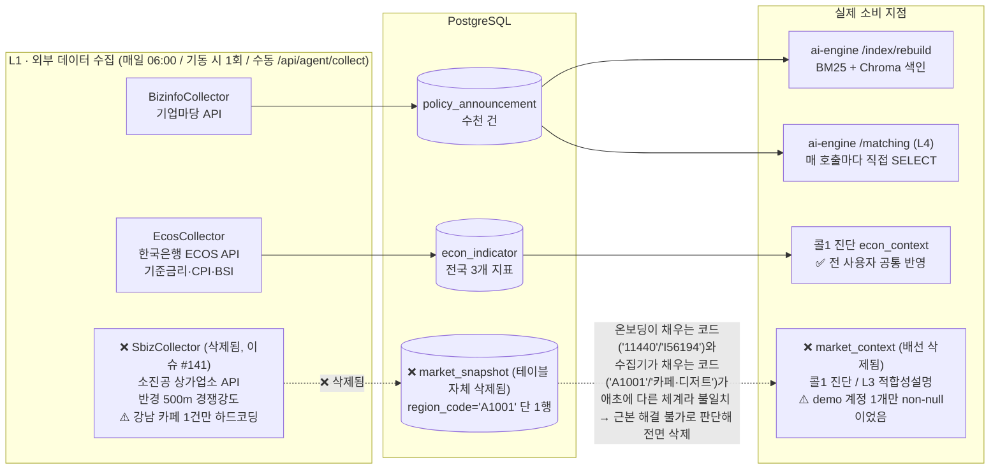

# 외부 데이터 수집기 — 무엇을 수집하고, 실제로 어디서/어떻게 쓰이는가

> **문서 목적**: `BizinfoCollector`/`EcosCollector`/`SbizCollector` 3개 L1 수집기가 각각 어떤 외부 API에서 무엇을 가져오고, 그 데이터가 실제로 어느 코드에서 읽혀 무엇에 반영되는지를 코드 기준으로 끝까지 추적한다. "수집되고 있다"와 "실제로 쓰이고 있다"는 다를 수 있어, 이번 조사에서는 소비 지점까지 실제로 도달하는지를 값(코드 일치 여부)까지 검증했다.
> **근거**: `apps/api-core/.../collect/*.java`, `PipelineService.java`, `ConsultationService.java`, `OnboardingController.java`, `db/init/04_seed_demo.sql`, `apps/ai-engine/app/services/rag/hybrid_search.py` 직접 확인.
>
> **✅ 후속 조치(2026-07-29, 이슈 #141 · PR #142)**: 아래 §4의 조사 결과("온보딩 코드값과 수집기 코드값이 애초에 다른 체계라 절대 일치하지 않는다")를 근거로, `SbizCollector`·`market_snapshot`·`market_context` 전달 코드를 전면 삭제했다. §4~§7은 **삭제를 결정하게 만든 조사 과정의 기록**으로 원문 그대로 남겨두되, 각 절 끝에 최종 처리 결과를 덧붙였다 — 지금 코드베이스에는 `SbizCollector`가 존재하지 않는다.

---

## 1. 한눈에 보기

| 수집기 | 데이터 소스 | 저장 테이블 | 실행 시점 | 실사용자에게 실제로 반영되는가 |
|---|---|---|---|---|
| `BizinfoCollector` | 기업마당(bizinfo.go.kr) API | `policy_announcement` | 매일 06:00 / 기동 시(최초 1회) / 수동 `/api/agent/collect` | **✅ 예 — 전체 매칭·리포트의 근간** |
| `EcosCollector` | 한국은행 ECOS OpenAPI | `econ_indicator` | 위와 동일(3개 수집기 항상 같이 실행) | **✅ 예 — 콜1 진단의 경기 컨텍스트로 전 사용자 공통 반영** |
| `SbizCollector` | 소진공 상가업소 상권정보 API | `market_snapshot` | ~~위와 동일~~ | ~~**⚠️ 사실상 아니오 — 코드 불일치로 데모 계정 1개만 반영, 그 외 전원 null**~~ → **❌ 2026-07-29 전면 삭제(이슈 #141)** — `SbizCollector`·`market_snapshot`·관련 배선 자체가 코드에서 사라짐 |

세 수집기 모두 API 키(`collector.bizinfo-key`/`collector.ecos-key`/`collector.sbiz-key`, `.env`)가 비어 있으면 조용히 스킵(`return 0`)하고 나머지 두 수집기·배치 전체를 죽이지 않는다 — 수집기 간 완전 독립 실패 격리.

---

## 2. BizinfoCollector — 정책자금 공고 (L4/L5의 원천 데이터)

### 무엇을 하나
- `GET https://www.bizinfo.go.kr/uss/rss/bizinfoApi.do?crtfcKey={key}&dataType=json` 로 전체 공고 목록을 매일 통째로 받아온다(중분 조회 API가 아니라 델타 없는 전량 응답 — 마감된 공고는 피드에서 사라지므로, 매일 적재해야 마감 이력 추적이 가능).
- 응답의 `jsonArray` 배열을 순회하며 `pblancId`(공고 ID)/`pblancNm`(제목)/`bsnsSumryCn`(요약 HTML)/`pldirSportRealmLclasCodeNm`(지원분야)/`trgetNm`(지원대상)/`jrsdInsttNm`(소관기관→지역 컬럼에 매핑)/`reqstBeginEndDe`("YYYY-MM-DD ~ YYYY-MM-DD" 신청기간 텍스트를 파싱)/`pblancUrl`(원문 링크)을 추출.
- `pblanc_id` 기준 `ON CONFLICT DO UPDATE SET last_seen_at = now()` — 이미 있는 공고는 갱신 시각만 찍고, 신규 공고만 전체 필드를 INSERT.
- 날짜 파싱은 방어적: "예산 소진시까지"/"상시모집" 같은 자유텍스트가 오면 `LocalDate.parse` 실패를 잡아 `null`로 저장(무리하게 캐스팅해 SQL 예외로 배치 전체를 죽이지 않음).
- 공고 하나가 이상해도(예상 못 한 필드) 그 건만 `catch`해 건너뛰고 나머지는 계속 적재.

### 어디서 쓰이나
1. **인덱싱** — `ai-engine indexing.py`의 `/index/rebuild`가 `apply_end >= CURRENT_DATE OR apply_end IS NULL` 조건으로 활성 공고만 읽어 BM25(Kiwi 토큰화)·Chroma(bge-m3 임베딩) 색인을 구성.
2. **매칭 조회** — `ai-engine hybrid_search.py`의 `/matching`이 **호출될 때마다** RRF로 융합된 `pblanc_id` 각각에 대해 `SELECT title, apply_end, detail_url, target, support_field, summary_html, region FROM policy_announcement WHERE pblanc_id=%s`를 직접 실행 — 이 값들이 지역/업종 하드필터(`_region_result`/`_industry_result`) 판정 근거이자, 화면 매칭 카드에 그대로 노출되는 제목·마감일·링크의 원천.
3. **결과적으로** L3(적합성 설명)·L5(리포트 생성)에 전달되는 `matches` 배열의 모든 필드가 이 테이블에서 나온다.

**결론**: 3개 수집기 중 유일하게 매 요청마다 실시간으로 소비되는, 파이프라인의 진짜 핵심 축.

---

## 3. EcosCollector — 경기지표 (콜1 진단의 거시 컨텍스트)

### 무엇을 하나
한국은행 ECOS `StatisticSearch` API에서 **3개 시계열**을 각각 조회한다(`SERIES` 상수):

| 시리즈 | 통계표코드 | 주기 | 조회기간 | `indicator_code` |
|---|---|---|---|---|
| 기준금리 | `722Y001` | 일(D) | 최근 120일 | `base_rate` |
| 소비자물가지수 | `901Y009` | 월(M) | 최근 395일 | `cpi` |
| 기업경기실사지수(BSI) | `512Y014` | 월(M) | 최근 395일 | `bsi` |

- `econ_indicator(indicator_code, value, observed_at)`에 `ON CONFLICT (indicator_code, observed_at) DO UPDATE` — 같은 지표·같은 관측일이면 값만 갱신.
- 관측점을 1건이 아니라 구간 전체(최대 120~395일치)로 매번 재적재 — 원래는 舊 `threshold_rule.window_days` 내 변화량을 계산하려던 설계(코드 주석: "TriggerEngine.latestEconMetric()의 `<code>_change_bp|_change_pct` 명명 규칙과 일치해야 하는 계약"). 이슈 #29로 `TriggerEngine` 자체가 제거되면서 **이 명명 규칙을 실제로 소비하는 코드는 더 이상 없다** — 계약은 죽었지만 수집 로직은 그대로 남아있는 상태.

### 어디서 쓰이나
- `ConsultationService.fetchEconContext()` — `SELECT DISTINCT ON (indicator_code) ...`로 **3개 지표 각각의 최신 관측치 1건씩**을 모아 `{base_rate: ..., cpi: ..., bsi: ...}` 형태로 콜1(`diagnosis.py`)의 `econ_context`에 실어 보낸다.
- **프로필/지역과 무관하게 전국 단일 값**이라, 이 값을 요청하는 순간 데이터가 있으면 **모든 사용자에게 동일하게** 반영된다 — "개인화"가 아니라 "공통 거시 배경 설명"에 가깝다(예: "요즘 기준금리가 OO%라 자금 조달 환경이 이렇다" 정도의 서술 근거).
- `ECOS_API_KEY`가 없으면 수집 자체가 생략되고, `econ_indicator`가 비어 있으면 `fetchEconContext()`가 빈 배열을 감지해 `null`을 반환 — 이 경우 콜1 프롬프트는 `econ_context` 없이 정상 동작(진단 프롬프트가 "없으면 언급하지 않는다"고 명시).

**결론**: 정상 작동. 다만 프로필별로 달라지지 않는 "전국 공통 배경지표" 수준의 기여도.

---

## 4. SbizCollector — 상권 데이터 (⚠️ 실사용자 경로에서 사실상 끊겨 있음 → ✅ 이슈 #141로 완전 제거됨)

> 아래는 삭제 결정 이전 시점(2026-07-28)의 조사 기록이다. 이 조사가 그대로 삭제 사유가 됐다.

### 무엇을 하나
- `GET https://apis.data.go.kr/B553077/api/open/sdsc2/storeListInRadius?cx={lon}&cy={lat}&radius=500` — 소진공 상가업소 API로 **좌표 기준 반경 500m** 내 전체 상가 목록을 받아, 응답 항목의 `indsLclsNm`/`indsMclsNm`/`indsSclsNm`(업종 대/중/소분류명) 중 하나라도 타겟 키워드(예: "카페", "커피")를 포함하면 카운트.
- 그 카운트를 `market_snapshot(region_code, industry_code, metric)`에 `jsonb_build_object('new_competitors_500m', ?)`로 저장.
- **`TARGETS`가 코드에 정확히 1건만 하드코딩돼 있다**:
  ```java
  new Target(37.4979, 127.0276, "A1001", "카페/디저트", List.of("카페", "커피"))
  ```
  좌표는 강남 일대, `region_code="A1001"`, `industry_code="카페/디저트"`. 코드 주석이 스스로 이렇게 인정한다: *"프로덕션 확장 시 business_profile의 distinct(market_region_code, market_industry_code) 조합을 좌표·키워드에 매핑하는 참조 테이블로 대체 필요 (지금은 데모 1건 — 업종·지역 하드코딩 임시 완화)."* — `CLAUDE.md`의 "업종·지역을 코드에 하드코딩하지 않는다" 원칙에 대한 **의도적·문서화된 예외**.

### 어디서 쓰이나 (그리고 왜 대부분 안 쓰이나)
`PipelineService.fetchMarketContext()`/`ConsultationService.fetchMarketContext()`가 프로필의 `market_region_code`/`market_industry_code`로 `market_snapshot`을 조회한다. 이 두 코드 값이 실제로 어떻게 채워지는지 끝까지 추적하면:

1. **사업자등록번호를 입력하지 않은 사용자**(온보딩에서 선택 사항) → `marketRegionCode`/`marketIndustryCode`가 빈 문자열로 남는다 → `fetchMarketContext`가 즉시 `null` 반환.
2. **사업자등록번호를 입력해 국세청 조회에 성공한 사용자** → `OnboardingController.bizStatus()`가 실제 지역/업종 대신 **항상 고정된 목업값** `marketRegionCode="11440"`, `marketIndustryCode="I56194"`을 반환한다(코드 주석: *"국세청 API 미제공 필드 — 목업 임시값 유지(화면2 API 책임 밖)"*, NTS API는 `b_stt_cd`(영업상태)만 제공하고 상권코드는 아예 내려주지 않음).
3. 그런데 `SbizCollector`가 실제로 적재하는 `market_snapshot` 행은 `region_code='A1001'`, `industry_code='카페/디저트'` **단 하나뿐**이다.
4. `"11440" ≠ "A1001"`, `"I56194" ≠ "카페/디저트"` — **코드값이 아예 다른 체계**(하나는 행정동 코드+업종 대분류 코드 흉내, 하나는 임의 문자열 "A1001"+한글 업종명)라 **절대 일치하지 않는다.**
5. 유일하게 일치하는 경우는 `db/init/04_seed_demo.sql`이 손으로 직접 맞춰 심어둔 데모 계정(`user_id=1`, username `demo`)뿐이다:
   ```sql
   INSERT INTO business_profile (..., market_region_code, market_industry_code)
   VALUES (..., 'A1001', '카페/디저트');
   ```

**결론(2026-07-28 시점)**: `SbizCollector`는 API 연동·저장 로직 자체는 정상 동작하지만, **온보딩에서 실제로 발급되는 코드값과 수집기가 채우는 코드값이 애초에 서로 다른 체계라 절대 만나지 않는다.** `demo` 계정으로 로그인했을 때만 `market_context`가 실제로 채워지고, 그 외 모든 신규 가입자에게는 상권 데이터가 조용히 생략된다(에러 없이 `null` → 프롬프트가 "없으면 언급 안 함"으로 우아하게 처리하므로 사용자에게 장애로 보이지는 않는다).

**✅ 최종 처리(2026-07-29, 이슈 #141)**: 지오코딩·상권코드 매핑 인프라 없이는 근본 해결이 불가능하고, `market_context`는 프롬프트에서 완전히 optional이라 핵심 가치(정책자금 매칭)와 무관하다고 판단해 §5의 "정당한 스코프 축소" 결론을 뒤집고 **기능 자체를 삭제**했다. 데모 계정만 우연히 동작하는 것처럼 보이는 상태를 코드에 남겨두는 게, 부분 구현을 유지하는 것보다 더 큰 리스크(코드 심사 시 "동작하는 척하는 코드"로 보일 위험)라고 봤다.

---

## 5. 왜 이런 구조가 됐는가 (2026-07-28 시점 판단 — §4 후속 조치로 결론이 뒤집힘)

- PRD(§5-1)부터 "카드사 소비 데이터는 접근 난이도가 높다"며 상권 축의 확보 난이도를 중(中)으로 명시했다.
- 소진공 상가업소 API는 **좌표+반경** 기반 조회라, "임의의 지역·업종 조합"을 실시간 커버하려면 프로필별 주소→위경도 변환, 업종명→상권API 코드 매핑이라는 별도의 큰 작업이 선행돼야 한다.
- 4주 해커톤 범위에서는 이 매핑 테이블을 만드는 대신, **데모 시나리오 1건(강남 카페)만 좌표를 하드코딩**하고 코드에 "프로덕션 확장 시 매핑 테이블 필요"라는 TODO를 명시적으로 남기는 쪽을 이 시점엔 선택했다.
- 당시엔 이걸 **의도적으로 좁혀놓고 코드에 그 사실을 남긴 스코프 축소**로 정리했다 — PRD 자체가 "MVP 범위는 의도적으로 좁게 잡는다"(§2)고 밝힌 원칙과 일관된 판단이었다.
- **다만 이후 재검토에서 이 판단을 뒤집었다**(§4 최종 처리 참고): "부분 구현을 남겨두고 TODO로 남긴다"보다 "핵심 가치와 무관하고 근본 해결도 불가능한 기능은 걷어낸다"가 더 정직한 선택이라고 결론지었다. 스코프를 좁히는 것과 죽은 배선을 그대로 두는 것은 다른 문제라는 걸 뒤늦게 구분한 사례.

---

## 6. 흐름도

> 아래는 **삭제 이전(2026-07-28) 시점의 구조**를 보여주는 역사적 기록이다. `SbizCollector`/`market_snapshot`/`market_context` 경로는 2026-07-29 이슈 #141로 코드에서 완전히 사라졌다 — 현재 실제 흐름은 `BIZ→PA`, `ECOS→EI→DIAG_ECON` 두 축만 남아있다.



---

## 7. 요약

| 수집기 | 코드 품질(수집·저장 로직 자체) | 실제 도달률 | 현재 상태 |
|---|---|---|---|
| Bizinfo | 정상, 방어적 에러 처리 잘 돼 있음 | 100% — 전체 매칭 파이프라인의 근간 | 유지 |
| Ecos | 정상, 舊 트리거용 명명 규칙만 죽은 계약으로 남음 | 100%(API 키 설정 시) — 단, 개인화 아닌 공통값 | 유지 |
| ~~Sbiz~~ | ~~정상, 다만 타겟이 1건 하드코딩~~ | ~~사실상 0%(데모 계정 1개 제외) — 온보딩 목업 코드와 불일치~~ | **❌ 2026-07-29 전면 삭제(이슈 #141, PR #142)** |
