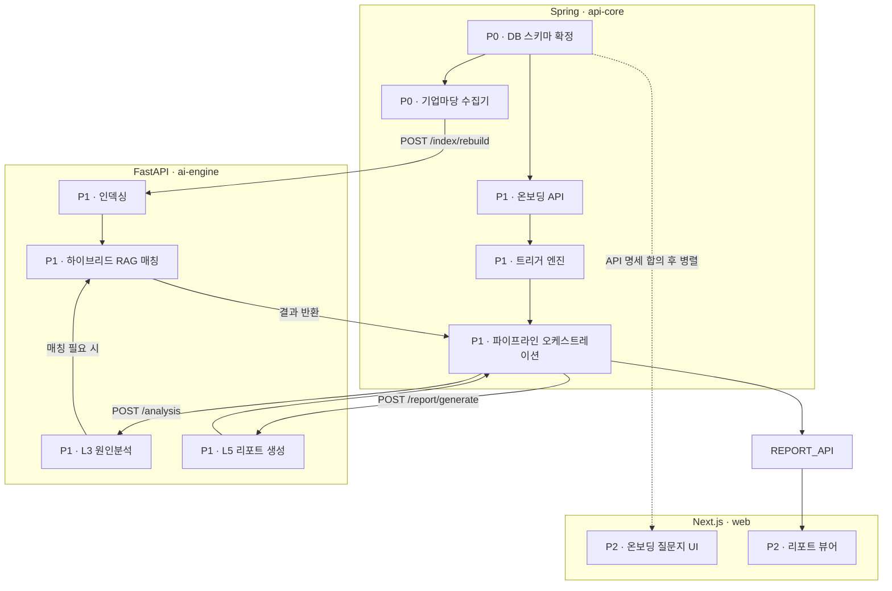

# 하네스 엔지니어링 기반 병렬 개발 프로세스 — 의존성 분류와 동시 실행 분석

> **문서 목적**: 이 프로젝트는 코드뿐 아니라 **개발 프로세스 자체**를 AI 하네스(다중 서브에이전트 + 오케스트레이션 스킬)로 설계했다. 이 문서는 (1) 하네스가 어떤 구조였는지, (2) 작업 간 의존성을 어떻게 분류했는지, (3) 의존성이 없는 작업들을 실제로 어떻게 병렬 실행했는지를 — 주장이 아니라 **GitHub 이슈·PR의 실제 타임스탬프**와 저장소에 커밋된 하네스 파일 자체를 근거로 정리한다.
> **작성 방법**: `.claude/agents/*`, `.claude/skills/dev-orchestrator|e2e-verify|rag-conventions/*`, `doc/planning/dependency_graph01.md`, `doc/planning/gap_analysis_01.md`, `.github/pull_request_template.md`, `_workspace/qa_*.md`(로컬 전용, 이번에 선별 반영)와 `gh issue list`/`gh pr list`의 실제 타임스탬프를 직접 조회해 검증했다.

---

## 1. 개요 — 왜 "개발 과정" 자체가 AI 활용 사례인가

이 프로젝트는 4주 해커톤을 **1인 개발자 + AI 서브에이전트 4종 + 오케스트레이션 스킬**로 진행했다(`CLAUDE.md` 변경 이력 2026-07-13). 단순히 "Claude에게 코드를 시켰다"가 아니라:

1. 서비스 경계(Spring/FastAPI/Next.js)를 그대로 **에이전트별 편집 권한(레인)**으로 매핑해, 서로 다른 에이전트가 같은 파일을 동시에 건드릴 수 없게 구조적으로 충돌을 차단했다.
2. 작업 착수 전 **의존성·계약 영향을 게이트로 강제**해, 뭘 병렬로 돌려도 안전한지를 사람이 매번 판단하지 않고 절차화했다.
3. 그 결과가 실제로 **같은 날 여러 시간대에 걸쳐 서로 다른 레인의 PR이 동시에 열려 있는** 패턴으로 GitHub 이력에 남아있다 — 아래 §4에서 실제 타임스탬프로 증명한다.
4. 후반부에는 **Claude Code와 Codex CLI를 병행**해 서로 다른 작업을 동시에 진행했다(§6) — 단일 도구가 아니라 멀티 AI 툴 워크플로우다.

---

## 2. 하네스 구조 — 에이전트 4종 + 스킬 3종 + 오케스트레이터 1종

`.claude/agents/*.md` (4개, 전부 git에 커밋됨):

| 에이전트 | 레인 (편집 허용 범위) | 핵심 역할 | 참조 스킬 |
|---|---|---|---|
| `backend-dev` | `apps/api-core/**`, `db/**` | 수집기·트리거 엔진·파이프라인·알림·REST API | — |
| `ai-dev` | `apps/ai-engine/**` | 하이브리드 RAG, Claude 프롬프트(진단·적합성설명·리포트·초안), 인덱싱 | `rag-conventions` |
| `web-dev` | `apps/web/**` | 온보딩 UI·알림 UI·리포트 뷰어, `lib/api.ts` 기반 Spring 연동 | — |
| `qa-verifier` | **편집 없음** (검증 리포트만) | 서비스 경계면 교차 검증(Spring↔FastAPI, web↔Spring, 코드↔DDL) | `e2e-verify` |

각 에이전트 정의 파일(`backend-dev.md` 등)에는 "편집 범위는 `apps/api-core/**`와 `db/**`만. 다른 디렉토리는 읽기 전용"처럼 **레인 경계가 명문화**돼 있다. 이게 병렬 실행의 전제 조건이다 — 파일시스템 경계가 겹치지 않으면 두 에이전트를 동시에 돌려도 머지 충돌이 구조적으로 발생하지 않는다.

### `dev-orchestrator` 스킬(`.claude/skills/dev-orchestrator/SKILL.md`) — 게이트 절차

```
Phase 0  컨텍스트 확인      — gh issue list로 열린 이슈 확인, 재실행이면 이전 QA 리포트 포함
Phase 1  Pre-게이트         — ① 레인 배정(두 레인 걸치면 레인별 분할) ② 계약 영향 체크(★최중요)
                              ③ DoD 확정(검증 가능한 완료조건 없으면 착수 금지)
Phase 2  위임               — 컨텍스트 패킷(작업ID·DoD·경계·계약슬라이스·대상파일)을 조립해 해당 에이전트 호출
Phase 3  Post-게이트        — ① 경계위반 grep 스캔 ② qa-verifier 위임(저작·검증 분리) ③ 마일스톤 E2E
Phase 4  상태 갱신·보고     — QA 통과 시 이슈 close, 실패 시 파일:라인과 함께 재위임(최대 2회)
```

문서에 명시된 병렬 규칙(원문 인용):

> "크리티컬 패스(S4→S5→S6)가 순차라 팀 통신이 불필요하다. 병렬은 **직교 작업에만** background 최대 2개 (예: backend-dev의 S5 ∥ web-dev의 W2 mock 선행)."

즉 병렬 실행은 무작위가 아니라 **"직교(orthogonal) 작업 + 최대 2개"**라는 명시적 상한 규칙 아래서 이뤄졌다.

`e2e-verify` 스킬은 게이트 6단계(트리거 발동→분석 저장→매칭 저장→리포트→알림→재실행 dedup)로 마일스톤 완주를 검증하는 절차를, `rag-conventions`는 과거 해커톤 노트북에서 검증/기각된 한국어 RAG 패턴을 ai-dev가 참고하도록 강제하는 절차를 담고 있다.

---

## 3. 의존성 분류 방법론

### 3-1. 계획 단계 — `doc/planning/dependency_graph01.md`

프로젝트 착수 시점에 작성된 작업 의존성 그래프(mermaid, 원문 그대로):



핵심 설계 포인트: **스키마 확정(P0)까지는 전부 직렬**이지만, 그 이후 `SCHEMA -. "API 명세 합의 후 병렬" .-> ONBOARD_UI`처럼 **점선(=병렬 가능)** 으로 프론트 트랙을 명시적으로 분리했다. "API 계약만 먼저 합의하면 백엔드 구현체가 없어도 프론트는 동시에 진행 가능"이라는 계약-우선(contract-first) 설계가 그래프 단계에서부터 들어가 있다.

### 3-2. 실행 단계 — 라벨 체계로 의존성을 데이터화

`doc/planning/gap_analysis_01.md`가 스펙-구현 갭 15건을 이슈 초안으로 변환하면서, 각 이슈에 **`priority/P0~P3` · `layer/0~6` · `area/backend|ai|frontend`** 3축 라벨을 부여했다. 실제 GitHub 이슈에 그대로 적용됨(`gh issue list`로 확인):

```
#1  priority/P1,layer/3,area/backend,pairing   — TriggerEngine 업종 조인 개선
#2  priority/P1,layer/2,area/backend           — BizinfoCollector INSERT 누락
#6  priority/P1,layer/3,area/ai                — 활성 공고 인덱스 필터
#8  priority/P1,layer/4,area/ai                — /matching evidence 필드
#9  priority/P2,layer/5,area/frontend          — 온보딩 제출 후 이동
#13 priority/P1.5,layer/5,area/backend,area/frontend,pairing — 카카오 알림(양쪽 걸침)
```

이 라벨 자체가 dev-orchestrator Phase 1의 "레인 배정" 판단 근거였다: `area` 라벨이 다르면 다른 레인 → 병렬 후보, 같으면 같은 레인 → 순차 후보. `area/backend,area/frontend`처럼 두 레인을 걸친 이슈(#13 카카오)는 스킬 문서의 "두 레인을 걸치면 레인별로 분할해 순차 위임" 규칙대로 처리됐다.

`.github/pull_request_template.md`에도 이 라벨 체계가 **PR 작성 시점의 체크박스**로 그대로 이식돼 있다:

```
**Layer** — [ ] Layer 0 인프라 [ ] Layer 2 수집기 [ ] Layer 3 트리거·AI추론 [ ] Layer 4 RAG매칭 [ ] Layer 5 API·UI·알림
**Area**  — [ ] backend [ ] ai [ ] frontend
**페어 작업** — [ ] 페어 세션 진행 후 구현
📋 인터페이스 계약 변경 — [ ] 계약 변경 없음 [ ] §2-1(web→Spring) 변경... [ ] §2-2(Spring→ai-engine) 변경... [ ] §2-3 DDL 변경...
```

"인터페이스 계약 변경" 체크박스는 dev-orchestrator Phase 1의 "계약 영향 체크(최중요 게이트)"를 PR 단위로 다시 한번 강제하는 이중 게이트다 — 계획 단계 라벨링 → 실행 단계 위임 게이트 → 리뷰 단계 PR 체크박스, 3중으로 같은 규칙(계약 변경은 양쪽 동시 반영)을 강제한 셈이다.

### 3-3. 레인 = 파일시스템 경계 기반 의존성 분리

의존성 그래프가 이론이라면, 레인은 그걸 **강제 가능한 형태**로 바꾼 장치다. `area/backend`인 두 이슈가 있어도 서로 다른 파일을 건드리면(예: `BizinfoCollector.java` vs `PipelineService.java`) 병렬 진행 가능 — 실제로 §4의 2026-07-16 사례에서 백엔드 레인 안에서만도 4개 PR이 동시에 열려 있었다(§4-2).

---

## 4. 실제 병렬 실행 증거 (GitHub 이슈/PR 타임스탬프)

`gh issue list --json createdAt,closedAt,labels`와 `gh pr list --json createdAt,mergedAt,headRefName`을 직접 조회해, **다른 `area` 라벨을 가진 이슈의 PR이 시간상 겹치는지(overlap: PR_A.created < PR_B.merged AND PR_B.created < PR_A.merged)** 를 계산했다. 아래는 실제로 겹친 쌍이다(추정이 아니라 스크립트 계산 결과).

### 4-1. 2026-07-16 오전 — backend ∥ ai

| PR | 브랜치(이슈) | 레인 | 오픈~머지 |
|---|---|---|---|
| #15 | `feat/#1` | backend | 02:04 ~ 02:45 |
| #16 | `feat/#8` | ai | 02:18 ~ 02:42 |

`#16`이 `#15`가 열려 있는 도중(02:18)에 열려서 `#15`가 닫히기 전(02:42)에 같이 닫혔다 — 24분간 backend·ai 레인이 동시에 활성 브랜치였다.

### 4-2. 2026-07-16 오전~낮 — backend(4개 동시 오픈) ∥ frontend(3개 순차)

```mermaid
gantt
    title 2026-07-16 병렬 실행 — 백엔드 4개 PR 장시간 동시 오픈 + 그 사이 프론트 3개 PR 진행
    dateFormat HH:mm
    axisFormat %H:%M
    section backend
    이슈#3 ECOS 수집기      :a1, 04:20, 09:45
    이슈#11 알림 API        :a2, 04:39, 09:42
    이슈#10 파이프라인 완성 :a3, 06:40, 09:43
    이슈#4 Sbiz 수집기      :a4, 06:56, 09:45
    section ai
    이슈#6 활성공고 필터    :b1, 09:45, 09:59
    이슈#7 Chroma 임베딩    :b2, 09:59, 10:00
    section frontend
    이슈#9 온보딩 이동      :c1, 06:57, 07:00
    이슈#12 알림 UI         :c2, 07:04, 07:15
    이슈#14 리포트 뷰어     :c3, 07:21, 07:26
```



백엔드 PR 4개(#3·#11·#10·#4)가 **04:20~09:45 사이 장시간 동시에 오픈된 채로** 있었고, 그 사이(06:57~07:26) 프론트 PR 3개가 빠르게 열리고 닫히며 진행됐다. 백엔드 4개가 09:42~09:45 사이 몰아서 머지된 뒤, ai 레인 2개(#6·#7)가 바로 이어졌다 — ai 작업이 인덱스/임베딩 관련이라 백엔드 수집기 완료를 사실상 전제하는(코드 강제는 아니지만 논리적 순서) 자연스러운 후행이다.

### 4-3. 2026-07-22 — backend+frontend(양쪽 걸침) ∥ ai

| PR | 브랜치(이슈) | 레인 | 오픈~머지 |
|---|---|---|---|
| #71 | `feat/#70` | backend, frontend | 03:13 ~ 03:54 |
| #73 | `fix/#72` | ai | 03:32 ~ 03:54 |

이슈 #70(데이터 준비 게이트 — `StartupDataSeeder`/`DataReadinessGate`, backend+frontend 동시 작업)과 이슈 #72(ai-engine 재임베딩 헬스체크 타임아웃 버그)가 41분간 겹쳤고 같은 분(03:54)에 함께 머지됐다.

### 4-4. 2026-07-23 — 초 단위로 겹치는 이슈 배치 클러스터

같은 날 오전, 서로 다른 버그 수정 이슈가 **생성 시각이 초 단위로 인접**한 클러스터가 여러 번 나타난다(같은 레인 내에서도 여러 작업을 빠르게 순차 처리한 사례):

```
#92 02:29:44 → #93 02:30:06 → #94 02:30:17   (22초, 11초 간격으로 3건 생성)
#92 closed 02:42:58, #93 closed 02:42:42, #94 closed 02:42:22            (16초 이내 3건 동시 종료)
#98 03:02:30 / #99 03:02:51                                              (21초 간격 생성, 16초 이내 종료)
#88 01:50:41 / #89 01:51:02                                              (21초 간격 생성)
```

이런 클러스터는 "리포트 품질 버그 여러 건을 한 번에 발견 → 이슈로 일괄 등록 → 오케스트레이터가 짧은 사이클로 연속 위임"한 패턴으로, 각 건의 작업량이 작을 때(수 줄~수십 줄 수정) 병렬보다 **고속 순차 처리**가 더 효율적이라는 판단이 반영된 것으로 보인다 — 즉 이 하네스는 "무조건 병렬"이 아니라 **작업 크기·독립성에 따라 병렬/순차를 구분해 적용**했다.

---

## 5. 의존성을 끊는 패턴 (계약 우선 설계)

의존성 그래프에 순서가 있어도, 두 가지 장치로 그 순서를 실제로는 우회해 병렬성을 늘렸다.

1. **Mock 우선 프론트 개발** (`web-dev.md` 에이전트 정의에 명시): "Spring 미기동 상태로 개발할 때는 계약 JSON을 Next route handler(`app/api/mock/`)로 세우고, 통합 시 `NEXT_PUBLIC_API_BASE_URL`만 원복한다." — 백엔드가 아직 없어도 **계약(응답 스키마)만 합의되면** 프론트를 동시에 만들 수 있다는 원칙. §3-1의 점선 화살표(`SCHEMA -. 병렬 .-> ONBOARD_UI`)가 실행 레벨에서 이 규칙으로 구현됐다.
2. **계약 변경은 항상 같은 사이클로 묶기**: dev-orchestrator Phase 1 게이트 — "이 작업이 CLAUDE.md 경계 원칙(API 경로·스키마)을 변경하는가? → 변경한다면 영향받는 양쪽 코드를 같은 사이클에 위임." 실제 사례가 `gap_analysis_01.md` §2-2에 남아있다: `/matching` 응답에 `evidence` 필드가 없어 계약이 불완전했던 문제(#8)를 ai-engine 쪽에서 먼저 해결하고, 그 직후(§4-1의 #15/#16 병렬 사례가 바로 이거다) Spring 쪽(`AiEngineClient`) 반영이 뒤따랐다.

---

## 6. 멀티 AI 툴 병행 — Claude Code + Codex CLI

이 저장소는 **하나의 AI 툴이 아니라 두 개**로 개발됐다. `CLAUDE.md`(Claude Code용)와 `AGENTS.md`(Codex CLI용)가 거의 동일한 내용으로 각각 유지되고(§ai-engine 행에서 "Claude 결과" vs "Codex 결과"로만 다름), 스킬 디렉토리도 `.claude/skills/`와 `.agents/skills/`로 미러링돼 있다(`dev-orchestrator`/`e2e-verify`/`rag-conventions` 3종 동일 내용, 커밋 `5a3ddde chore: add project agent development harness`, PR #122).

`gh pr list`의 브랜치명에서 `codex/*` 접두사 브랜치가 이 시기부터 등장하며, **Claude Code 세션과 겹치는 시간대에 진행**됐다:

| PR | 브랜치 | 도구 | 오픈~머지 |
|---|---|---|---|
| #121 | `feat/web-landing-dashboard-ui-refresh` | Claude Code(이 세션) | 07-27 02:26 ~ 04:03 |
| #122 | `codex/project-agent-harness` | Codex | 07-27 04:07 ~ 04:09 |
| #123 | `codex/fix-consult-no-match` | Codex | 07-27 06:33 ~ 06:34 |
| #124 | `codex/fix-ineligible-policy-gate` | Codex | 07-27 07:06 ~ 07:08 |
| #127 | `codex/add-report-resume-action` | Codex | 07-27 09:41 ~ 07-28 07:11 |
| #128 | `feat/notification-message-composer` | (별도 작업자/도구) | 07-27 12:32 ~ 07-28 07:11 |
| #129 | `codex/refine-home-responsive-header` | Codex | 07-28 06:32 ~ 07:12 |

`#127`·`#128`은 **거의 22시간 동안 동시에 오픈된 채** 07-28 07:11~07:12에 나란히 머지됐고, 그 사이(07-28 06:32~) `#129`도 함께 진행됐다 — 서로 다른 파일 범위(리포트 재개 액션, 알림 메시지 조합, 홈 반응형 헤더)를 건드려 레인이 겹치지 않았기에 가능했다. 이 시간대에 이 세션(Claude Code)은 §UI 리디자인 PR #121을 마무리하고 이어서 대회 제출용 문서화(§`competition_submission_architecture_2026-07-28.md`) 작업을 진행하고 있었다 — **한 저장소에서 사람 1명 + AI 툴 2종(Claude Code, Codex CLI)이 서로 다른 레인을 동시에 작업**한 것이 커밋 히스토리에 그대로 남아있다.

---

## 7. 검증-저작 분리 — qa-verifier가 실제로 만든 산출물

dev-orchestrator Phase 3의 "저작·검증 분리 원칙"(구현 에이전트가 자기 작업을 스스로 승인하지 않음)에 따라, `qa-verifier`는 `_workspace/qa_{작업ID}.md`에 검증 리포트를 남겼다. 이 디렉토리는 `.gitignore`(`_workspace/`)로 원격에는 한 번도 반영되지 않았던 로컬 전용 산출물이라, 이번에 대표 사례 3건을 골라 `doc/2026-07-28/qa-reports-examples/`에 옮겨 실제로 반영한다:

| 파일 | 검증 대상 | 시점 | 판정 |
|---|---|---|---|
| `qa_S6.md` | 알림 API(`notification` 패키지) — DDL↔Entity 교차검증 | 2026-07-16 | CONDITIONAL PASS (P1 이슈 2건 지적: `@GeneratedValue` 누락, PATCH 응답 stale read) |
| `qa_issue29.md` | 이슈 #29 피벗(임계값 트리거 폐지 → 프로필 기반 매칭) 전체 재검증 | 2026-07-20 | 아키텍처 전환의 핵심 마일스톤 검증 |
| `qa_ineligible_policy_gate.md` | 결격 공고 사전 배제(L3 자격 게이팅) | 2026-07-27 | 최근 기능의 경계면 검증 |

각 리포트는 qa-verifier 에이전트 정의가 요구하는 "통과/실패(파일:라인+수정방법)/미검증(사유)" 3분류 형식을 그대로 따른다 — `qa_S6.md`의 예:

> `Notification.id`에 `@GeneratedValue` 누락 — 실사용 경로에서는 문제 없음(JdbcTemplate만 사용). 계약 완결성 관점에서는 붙여두는 편이 안전.

이는 "구현했다"는 자기 보고가 아니라, **별도 에이전트가 코드와 DDL을 양쪽 다 열어 교차 대조한 기록**이라는 점에서 이 하네스의 QA 방법론이 실제로 작동했다는 근거다.

---

## 8. 정리 — 이 프로세스에서 강조할 포인트

1. **의존성 분류가 문서 한 번으로 끝나지 않고 3단계로 강제됨**: 계획 단계(dependency_graph01.md의 병렬 트랙 표시) → 실행 단계(priority/layer/area 라벨 + dev-orchestrator Pre-게이트) → 리뷰 단계(PR 템플릿 체크박스). 한 곳에서만 지켜지면 드리프트가 나지만, 3곳에서 같은 규칙을 반복 강제해 실제로 지켜졌다.
2. **병렬성의 근거가 "느낌"이 아니라 파일시스템 경계**: 에이전트별 편집 레인이 서비스 경계(Spring/FastAPI/Next.js)와 1:1로 대응해, 두 에이전트가 같은 파일을 두고 경합할 수 없는 구조였다.
3. **실제 병렬 실행이 GitHub 타임스탬프로 증명됨**: 2026-07-16(backend∥ai, backend 4건 동시오픈∥frontend 3건), 2026-07-22(backend+frontend∥ai) 등 여러 날에 걸쳐 서로 다른 레인의 PR이 실제로 겹쳐 있었다.
4. **작업 크기에 따라 병렬/고속순차를 구분 적용**: 큰 기능은 레인별 병렬(§4-1·4-2·4-3), 자잘한 버그 다건은 초 단위 간격의 고속 순차 클러스터(§4-4) — "무조건 병렬"이 아니라 상황에 맞춘 판단이었다.
5. **멀티 AI 툴 병행**: Claude Code와 Codex CLI가 같은 저장소에서 서로 다른 레인을 동시에 작업(§6) — 도구 하나에 의존하지 않는 하네스 설계.
6. **검증-저작 분리가 실제로 산출물을 남김**: qa-verifier의 교차검증 리포트가 로컬에만 있던 것을 이번에 선별 반영(§7) — 주장이 아니라 기록으로 남은 QA.
