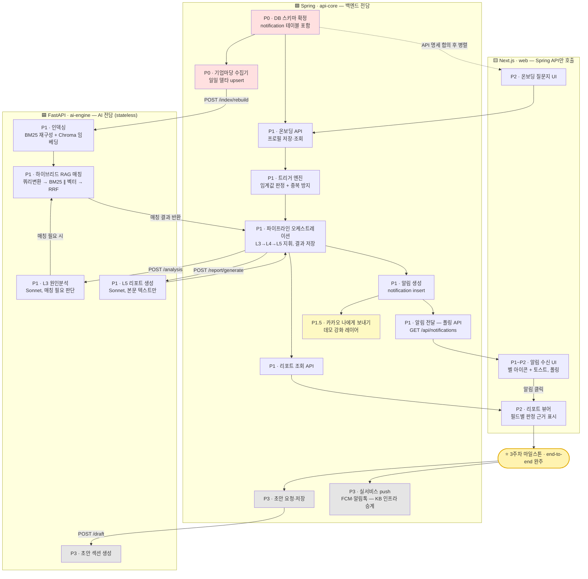

version.01
## 작업 의존성 그래프

```mermaid
flowchart TB
    subgraph SPRING["🟩 Spring · api-core — 백엔드 전담"]
        SCHEMA["P0 · DB 스키마 확정<br/>notification 테이블 포함"]
        COLLECT["P0 · 기업마당 수집기<br/>일일 델타 upsert"]
        ONBOARD["P1 · 온보딩 API<br/>프로필 저장·조회"]
        TRIGGER["P1 · 트리거 엔진<br/>임계값 판정 + 중복 방지"]
        PIPELINE["P1 · 파이프라인 오케스트레이션<br/>L3→L4→L5 지휘, 결과 저장"]
        NOTI["P1 · 알림 생성<br/>notification insert"]
        POLL["P1 · 알림 전달 — 폴링 API<br/>GET /api/notifications"]
        KAKAO["P1.5 · 카카오 나에게 보내기<br/>데모 강화 레이어"]
        REPORT_API["P1 · 리포트 조회 API"]
        DRAFT_API["P3 · 초안 요청·저장"]
        PUSH["P3 · 실서비스 push<br/>FCM·알림톡 — KB 인프라 승계"]
    end

    subgraph FASTAPI["🟦 FastAPI · ai-engine — AI 전담 (stateless)"]
        INDEX["P1 · 인덱싱<br/>BM25 재구성 + Chroma 임베딩"]
        RAG["P1 · 하이브리드 RAG 매칭<br/>쿼리변환 → BM25 ∥ 벡터 → RRF"]
        L3["P1 · L3 원인분석<br/>Sonnet, 매칭 필요 판단"]
        L5["P1 · L5 리포트 생성<br/>Sonnet, 본문 텍스트만"]
        DRAFT["P3 · 초안 섹션 생성"]
    end

    subgraph WEB["🟨 Next.js · web — Spring API만 호출"]
        ONBOARD_UI["P2 · 온보딩 질문지 UI"]
        NOTI_UI["P1~P2 · 알림 수신 UI<br/>벨 아이콘 + 토스트, 폴링"]
        REPORT_UI["P2 · 리포트 뷰어<br/>필드별 판정 근거 표시"]
    end

    MILESTONE(["⭐ 3주차 마일스톤 · end-to-end 완주"])

    %% 크리티컬 패스
    SCHEMA --> COLLECT
    SCHEMA --> ONBOARD
    COLLECT -- "POST /index/rebuild" --> INDEX
    INDEX --> RAG
    ONBOARD --> TRIGGER
    TRIGGER --> PIPELINE
    PIPELINE -- "POST /analysis" --> L3
    L3 -- "매칭 필요 시" --> RAG
    RAG -- "매칭 결과 반환" --> PIPELINE
    PIPELINE -- "POST /report/generate" --> L5
    L5 --> PIPELINE
    PIPELINE --> REPORT_API
    PIPELINE --> NOTI

    %% 알림 트랙
    NOTI --> POLL
    NOTI --> KAKAO
    POLL --> NOTI_UI
    NOTI_UI -- "알림 클릭" --> REPORT_UI

    %% 프론트 병렬 트랙
    SCHEMA -. "API 명세 합의 후 병렬" .-> ONBOARD_UI
    ONBOARD_UI --> ONBOARD
    REPORT_API --> REPORT_UI

    %% 마일스톤과 P3
    REPORT_UI --> MILESTONE
    MILESTONE --> DRAFT_API
    DRAFT_API -- "POST /draft" --> DRAFT
    MILESTONE --> PUSH

    %% 스타일
    style SCHEMA fill:#ffe0e0
    style COLLECT fill:#ffe0e0
    style MILESTONE fill:#fff3b0,stroke:#e0a800,stroke-width:2px
    style KAKAO fill:#fef9c3
    style DRAFT_API fill:#e5e5e5
    style DRAFT fill:#e5e5e5
    style PUSH fill:#e5e5e5
```
