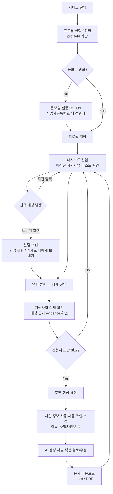
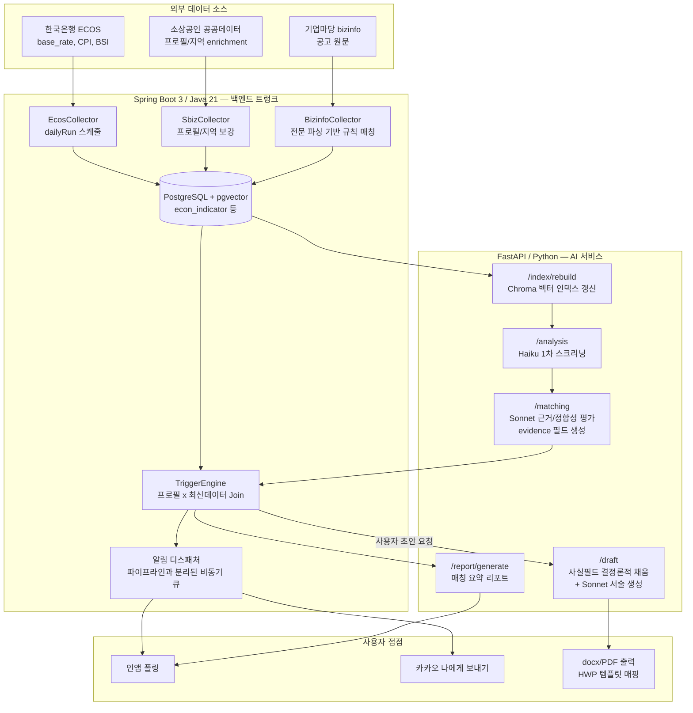

# biz-agent 사용자 플로우 & 기능 플로우

> 소상공인 대상 정부지원사업 매칭 및 신청서 초안 지원 서비스
> 핵심 가치: 사용자가 직접 검색하지 않아도, 정책·시장 변화를 감지해 먼저 알려주는 **선제적(proactive) 개입**

> **📌 코멘트 (2026-07-19, 이슈 [#29](https://github.com/KB-AI-Challenge-Just-it/opro/issues/29))**: 이 문서의 "선제적 개입" 방향과 TriggerEngine이 프로필+매칭 데이터를 조인한다는 설명(§2, 111행)은 이슈 #29와 같은 방향이다. 다만 §2 다이어그램의 `DB → TRIGGER`(econ_indicator를 트리거에 포함)는 이슈 #29에서 **다르게 확정**됐다:
> - `econ_indicator`(ECOS 기준금리·물가·BSI): 트리거·매칭 양쪽에서 **완전 폐기** — 전국 단일 계열이라 프로필별 개인화가 안 됨. 수집기 코드는 PRD "실연동 ≥3" 성공기준 유지용으로만 남기고 파이프라인 미연결.
> - `market_snapshot`(상권): 트리거 용도는 폐기, **매칭 근거 보강용으로만** 유지.
> - `/analysis`(L3)의 역할도 "Haiku 1차 스크리닝"이 아니라 Sonnet 유지 + "왜 이 공고가 프로필에 맞는지" 설명(fit-explanation)으로 재정의됨.
> - 목표 아키텍처 최신본은 `doc/system_flow_overview.md` 참고.

---

## 1. 사용자 플로우 (User Flow)

인증은 스코프 외이며, 데모에서는 프로필(profileId) 전환으로 개인화를 시연한다.

**단계별 설명**

1. **진입/프로필**: 로그인 없이 profileId로 페르소나를 전환해 개인화를 시연한다.
2. **온보딩**: Q1~Q9 폐쇄형 설문(사업자등록번호만 예외)으로 완료율과 데이터 정규화를 동시에 확보한다.
3. **대시보드**: 매칭된 지원사업을 목록으로 확인하는 것이 기본 화면이다.
4. **알림 기반 재방문**: 사용자가 다시 검색하지 않아도 트리거 발생 시 인앱/카카오 알림으로 유입된다. 이 부분이 서비스의 차별점이다.
5. **상세/근거 확인**: 왜 이 공고가 매칭됐는지 evidence를 확인한다.
6. **초안 작성**: 사실 필드는 자동으로 채워지고, 서술형 섹션만 검토/수정한 뒤 docx/PDF로 받는다. (HWP 자체 생성은 서버단에서 불가하여 미지원)

---

## 2. 기능 플로우 (System / Feature Flow)

Spring(백엔드 트렁크)과 FastAPI(AI 서비스) 경계는 5개 계약 엔드포인트로 고정된다: `/index/rebuild`, `/analysis`, `/matching`, `/report/generate`, `/draft`

**계층별 설명**

- **수집 계층**: `EcosCollector`, `BizinfoCollector`, `SbizCollector`는 각각 독립적으로 실행/예외 처리된다. (주의: `collect()` 호출을 `log.info()` 인자 안에서 평가하면 Java가 인자를 모두 먼저 평가하기 때문에 컬렉터별 예외 격리가 깨진다 — PR #17에서 발견된 이슈)
- **인덱싱**: 새 공고/지표가 쌓이면 `/index/rebuild`로 Chroma 벡터 인덱스를 갱신한다.
- **분석/매칭**: `/analysis`에서 Haiku로 저비용 1차 스크리닝 후, `/matching`에서 Sonnet이 근거(evidence)를 포함해 정밀 평가한다. 태그 기반(예: "소상공인" 태그)만 쓰면 매칭 풀이 과도하게 줄어들기 때문에 공고 전문을 파싱하는 규칙 기반 탐색을 병행한다.
- **TriggerEngine**: 사용자 프로필과 최신 수집/매칭 데이터를 조인해 알림을 발생시킬지 판단하는 핵심 로직. 현재 지훈과 페어링 대상(#9, #4). **(코멘트, 이슈 #29)**: `econ_indicator`를 이 조인에 포함하는 건 이슈 #29에서 폐기로 확정 — 트리거는 "프로필×신규/변경 매칭" 기준으로만 판단하고, 상권(`market_snapshot`)은 트리거가 아닌 매칭 근거로만 쓴다.
- **알림**: 실패해도 핵심 파이프라인 트랜잭션에 영향을 주지 않도록 구조적으로 분리한다. 1순위는 인앱 폴링, 2순위(데모 강화용)는 카카오 "나에게 보내기" API.
- **초안 생성**: `/draft`에서 사실 필드는 사용자 입력/프로필에서 결정론적으로 채우고, 서술 섹션만 AI가 생성한다. 정부 양식이 HWP인 경우가 많지만 서버에서 HWP를 직접 생성하는 것은 불가능하므로(라이선스된 Hancom 필요) docx/PDF로 출력하고, MVP용으로 1~2개 양식을 사전 확보해 매핑한다.

---

## 3. 모델/우선순위 원칙 (참고)

- Haiku: 스크리닝 등 경량 작업 / Sonnet: 근거 평가·서술 생성 등 추론 비중이 높은 작업
- P0~P3 우선순위 체계로 이슈·기능 관리
- 데모에서 "선제적 개입"은 실제 실시간이 아닌 시뮬레이션으로 재현되며, 하이브리드 검색·모델 티어링은 차별점이 아니라 기본 전제로 간주하고 실제 차별점은 (1) 에이전틱 선제 개입, (2) KB 자산 연동에 둔다.
